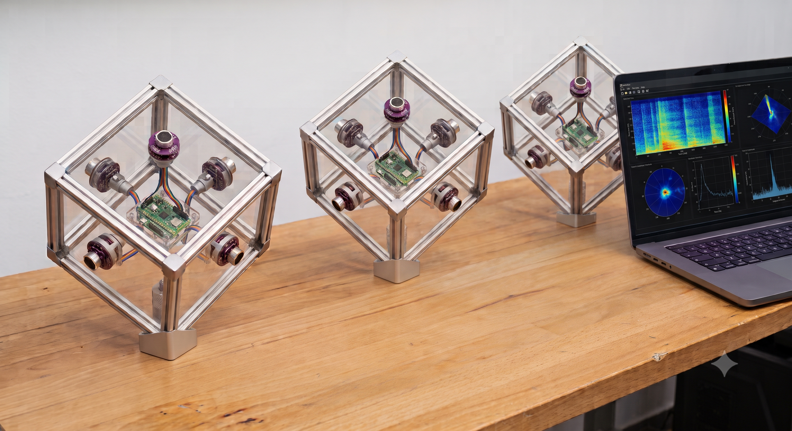

# het68 — 6-channel I2S USB sound card for Raspberry Pi Pico 2 (RP2350)

<p align="center">
  
</p>

This firmware turns a Raspberry Pi Pico 2 (RP2350) into a 6-channel USB audio
input device (microphone). It captures six independent I2S data lines from six
ICS-43434 MEMS microphones (SEL hardwired GND, left channel only), moves the
samples into memory with DMA, and streams them to the host over USB Audio Class
2.0 (UAC2) using TinyUSB.

## Audio format

| Property | Value |
|---|---|
| Class | USB Audio Class 2.0 (UAC2), isochronous IN |
| Channels | 6 |
| Sample rate | 48 kHz |
| Sample format | 24-bit signed, packed little-endian (`S24_3LE`, 3 bytes/sample) |
| USB packet | 1 ms = 48 × 6 × 3 = 864 bytes (within the 1023-byte full-speed iso limit) |
| Product string | `Pico 6ch Microphone 48k/24` |

The host sees a standard 6-channel 48 kHz / 24-bit capture device and can record
all six microphones simultaneously (e.g. with `arecord`, Audacity, Reaper, OBS).

```bash
arecord -D hw:<card>,0 -c 6 -r 48000 -f S24_3LE -d 3 capture.wav
```

## How capture works

- The Pico is the I2S **master**. One PIO state machine generates the shared
  `WS`/`SCK` clocks for all six microphones.
- Six PIO RX state machines (one per mic SD line on GP16/18/20/26/27/28) capture
  serial data. Mics 1–3 use PIO0; mics 4–6 use PIO1 (same clkdiv, started
  together). Each line reads the **left** I2S slot (SEL hardwired GND on modules).
- DMA moves the captured 32-bit slots into a double-buffered memory region; the
  USB device task packs them into 24-bit `S24_3LE` frames.

## Hardware wiring (Grove Shield for Pi Pico)

Board: **Seeed Grove Shield for Pi Pico v1.0**. Shield power switch → **3.3 V**
(never 5 V — destroys ICS-43434).

Each microphone needs **two** 4-pin Grove cables (clock + data). **Cable colours are
the same on every cable** — only the shield socket and mic socket change.

### Grove 4-pin cable — wire colours

| Pin | Wire colour | Usual name |
|-----|-------------|------------|
| **1** | **white** | signal (lower-number pin) |
| **2** | **yellow** | signal (higher-number pin) |
| **3** | **red** | VCC (3.3 V from shield) |
| **4** | **black** | GND |

On the mic breakout, strap **SEL → GND** (left channel only). The **yellow** wire
(pin 2) on the **data** cable is not connected on the module.

### Wiring overview

```
Shield                          Each mic module (×6)
────────                        ────────────────────
[UART0]─────── Debug Probe      (no mic cable)
[UART1]──clock──► Mic1 CLK IN ──► CLK OUT ──► Mic2 ──► Mic3
[I2C0]──clock───► Mic4 CLK IN ──► CLK OUT ──► Mic5 ──► Mic6
[D16]──data─────► Mic1 DATA
[D18]──data─────► Mic2 DATA
[D20]──data─────► Mic3 DATA
[A0]──data──────► Mic4 DATA
[A1]──data──────► Mic5 DATA
[A2]──data──────► Mic6 DATA
[I2C1]────────── PS1240 piezo (no mic)
```

### Clock cable (7× Grove cable — same colours on every clock cable)

From shield into **CLK IN** on mic 1 (branch A) and mic 4 (branch B); daisy-chain
**CLK OUT → CLK IN** along each branch. **Do not use red (pin 3)** on clock cables.

| Pin | Wire | Shield / mic signal | GPIO |
|-----|------|---------------------|------|
| 1 | **white** | **SCK** | GP9 |
| 2 | **yellow** | **WS** | GP8 |
| 3 | red | *not used* | — |
| 4 | **black** | **GND** | GND |

| Branch | Plug shield clock socket into | Then daisy-chain |
|--------|------------------------------|------------------|
| Mics 1–3 | **UART1** | Mic1 → Mic2 → Mic3 |
| Mics 4–6 | **I2C0** | Mic4 → Mic5 → Mic6 |

*(UART1 and I2C0 are the same GP8/GP9 on the PCB — two sockets, one clock bus.)*

### Data cable (6× Grove cable — identical colours on every mic)

Plug shield end into the port in the **Mic** column; plug mic end into **DATA**.
Use **pin 1 (white)** for SD on analog ports A0–A2 (do not use pin 2 there).

| Pin | Wire | Mic module (ICS-43434) | Shield port |
|-----|------|------------------------|-------------|
| 1 | **white** | **SD** (serial data) | see table below |
| 2 | yellow | *not used* (SEL = GND on PCB) | — |
| 3 | **red** | **VDD** (3.3 V) | same socket |
| 4 | **black** | **GND** | same socket |

| Mic | USB ch | Shield **data** socket | SD GPIO (pin 1 white) |
|-----|--------|------------------------|------------------------|
| 1 | 1 | **D16** | GP16 |
| 2 | 2 | **D18** | GP18 |
| 3 | 3 | **D20** | GP20 |
| 4 | 4 | **A0** | GP26 |
| 5 | 5 | **A1** | GP27 |
| 6 | 6 | **A2** | GP28 |

**Analog ports A0–A2:** the shield ties A0 pin 2 to A1 pin 1 (GP27) and A1 pin 2
to A2 pin 1 (GP28). Use only **pin 1 (white)** on each port — one mic per socket.

### Debug UART — Grove **UART0** → Raspberry Pi Debug Probe

| Pin | Wire | GPIO | Signal | → Probe connector **U** |
|-----|------|------|--------|-------------------------|
| 1 | **white** | GP1 | UART RX | ← Probe **TX** (orange) |
| 2 | **yellow** | GP0 | UART TX | → Probe **RX** (yellow) |
| 3 | red | — | not used | — |
| 4 | **black** | GND | ground | GND |

Baud rate: **115200** (`./serial.sh`).

### Sync beacon — Grove **I2C1** → PS1240 piezo

Passive piezo between the two signal wires. **Do not use red or black** on this cable.

| Pin | Wire | GPIO | Signal |
|-----|------|------|--------|
| 1 | **white** | GP7 | Piezo B |
| 2 | **yellow** | GP6 | Piezo A |
| 3 | red | — | not used |
| 4 | black | — | not used |

### GPIO quick reference

| Grove port | Function | GPIO |
|------------|----------|------|
| **UART0** | Debug UART | GP0 TX, GP1 RX |
| **UART1** | Clock branch mics 1–3 | GP9 SCK, GP8 WS |
| **I2C0** | Clock branch mics 4–6 | GP9 SCK, GP8 WS |
| **I2C1** | Piezo beacon | GP6, GP7 |
| **D16 / D18 / D20** | Mic 1–3 SD | GP16 / GP18 / GP20 |
| **A0 / A1 / A2** | Mic 4–6 SD (pin 1) | GP26 / GP27 / GP28 |
| *(header)* | Grove DPS310 barometer (optional) | **GP2 SDA / GP3 SCL** (I2C1) |

### Barometer — Grove DPS310 (optional, v1.2.1+)

**Seeed 101020812** Infineon DPS310 (300–1200 hPa, −40–85 °C). Wire to free
header pins **GP2 (SDA) / GP3 (SCL)** + 3V3/GND — **not** to shield I2C0/I2C1
(those are mic clocks / piezo). Firmware probes `0x77` then `0x76`; if the pins
are busy or no device answers, baro is skipped. CLI: `BARO` (aliases `DPS`,
`PRESSURE`); also in `STATUS`, boot dump, and heartbeat (`baro=…hPa`).
**v1.2.3:** moist-air speed of sound (Cramer/NPL-style) from DPS310 **T+P**
and assumed **RH** (default 50 %, set with `BARO RH <0-100>`):
Arden-Buck \(p_{sat}\), \(x_w=RH\cdot p_{sat}/p\), then
\(c=331.36\sqrt{T_K/273.15}\,(1+0.314 x_w+0.037 x_w^2)\).
Shown as `SOUND c=…` / `BARO … c=…`; fed into DOA TDOA (default 343 m/s
without baro). Details: [`wiring_and_bom.md`](wiring_and_bom.md),
[Seeed wiki](https://wiki.seeedstudio.com/Grove-High-Precision-Barometric-Pressure-Sensor-DPS310/).

BOM and module layout: `wiring_and_bom.md`.

## Drone detection (DOA + sync beacon)

Alongside the USB sound card the firmware runs an autonomous acoustic front-end:

* **Multi-source DOA (drone + vehicle + bird + walker + wind) with CLI + DET log.**
  core1 runs parallel front-ends:

  | Class | Band | Cue | Tracks |
  |---|---|---|---|
  | **drone** | ~800 Hz–6 kHz | continuous, **wind gate kept**, crest limit | up to **2** |
  | **wind** | LPF ~250 Hz | same energy as the gate → **intensity + steered az/el** | status |
  | **vehicle** | ~80 Hz–2.5 kHz | pass-by → **ICE** / **EV** | up to **2** |
  | **bird** | ~2–8 kHz | chirp bout → songbird / corvid / bird | up to **2** |
  | **walker** | ~150 Hz–600 Hz | footstep bout (≥3 steps) → human/cat/dog | **1** |

  **Entity gallery** (`entity_store`) = classification templates (ACID dual-slot,
  last two flash sectors). **Detection log** (`detection_log`) = timed events in a
  **separate** flash region (two sectors below the gallery) with `first_seen`,
  `last_seen`, `occurrence`, `max_gap_ms`. DET timestamps are written **only after**
  `TIME SYNC <unix>` since boot. `DET EXPORT` emits **JSON Lines** (`NVREVT`) for
  smart-NVR event correlation.

  UART **CLI** (help on boot / first byte / USB mount): `HELP`, `STATUS`,
  `TIME` / `TIME INFO` / `TIME SYNC`, `LOG ON|OFF`,
  `DET LIST|EXPORT|BACKUP|IMPORT|DEL|CLEAR`, `ENT LIST|EXPORT|IMPORT`,
  `DRONE LIST|CLEAR`, `BARO`, `RID LIST|ON|OFF`. See [`TEST_SCENARIOS_1.0.6.md`](TEST_SCENARIOS_1.0.6.md).

* **OpenDroneID / EU Direct Remote ID (v1.1.0+).** On CYW43 boards
  (`PICO_BOARD=pimoroni_pico_plus2_w_rp2350` or other Pico W variants) the
  firmware scans BLE advertisements for service UUID `0xFFFA` and parses ASTM
  F3411 Basic ID + Location + **System** messages (e.g. Dronetag / built-in RID).
  Tracks show up in the heartbeat as `rid=N`, via `RID LIST`, and as DET class
  `remoteid`. **v1.1.1:** System-message timestamp (ODID 2019 epoch → Unix)
  auto-applies `TIME SYNC` when unsynced or when drift ≥ 2 s (rate-limited), so
  DET timestamps work without a UART `TIME SYNC`. **v1.1.2:** `TIME INFO`
  reports sync **source / age / quality**; known drones (+ RID fields) persist
  in a flash ACID store (`DRONE LIST`); `STATUS` dumps all stored data and
  statistics (also printed on boot). **v1.2.1:** optional Grove **DPS310**
  barometer on GP2/GP3 (`BARO`). Non-wireless `pico2` builds compile a stub
  for RID. Flash end layout: DRONE / BT TLV / DET / ENT (two sectors each).

  ```
  SRC class=wind az=180.0 el=10.0 inten=-22.5dB
  SRC class=drone id=0 az=137.4 el=22.8 conf=0.7 lvl=-31.2dB
  DET id=3 class=wind first=1720000000 last=1720000012 occ=8 max_gap_ms=400 az=180.0 el=10.0 inten=-22.5dB
  TRACKS drone=1 vehicle=0 bird=0 walker=0 wind=1 entity=0
  ```

  - Species / ICE·EV / wind direction / re-ID are best-effort heuristics
    (v1.0.7: soft score bands, gait regularity, ambiguity→generic bird, tighter
    cross-class gates). Still not a trained model.
  - Walker tracking assumes **one** walking entity at a time.

* **Array geometry.** A cube standing on a vertex, **512 mm** edge. Mics 1–3 are
  the three upper faces (mic 1 = north, then +120°, +240° azimuth, all at +35.26°
  elevation); mics 4–6 are the opposite lower faces (−35.26° elevation, azimuths
  interleaved by 60°). Select the edge at build time with any integer size —
  `HET68_DOA_EDGE_MM=150 ./build.sh` (default 512 mm); `DOA_MAXLAG` and the
  comparison window derive from it automatically. How to physically build the cube,
  what to build it from, and a full edge-length trade-off analysis (accuracy, speed,
  compute, memory) are in [`array_cube_design.md`](array_cube_design.md).

* **Synchronisation beacon.** The PS1240 piezo emits a periodic BPSK-modulated
  m-sequence burst on a ~4 kHz carrier (its resonance), driven differentially via
  the GP6/GP7 software H-bridge. This pseudo-noise code is what neighbouring nodes
  will cross-correlate (matched filter) for acoustic ranging / clock sync; the
  receive/ranging side is a later phase. The beacon count appears in the heartbeat
  (`bcn=`).

## Downloads

Pre-built firmware for each tagged release is published on GitHub Releases:

**https://github.com/fedurca/het68/releases**

Create a GitHub Release whose tag is SemVer core ([semver.org](https://semver.org/))
— `x.y.z` or `vx.y.z` (e.g. `1.2.3` / `v1.2.3`) — and CI builds the default
`pico2` firmware and attaches `.uf2` / `.elf` assets to that release.

## Build

The Pico SDK is cloned locally into `./pico-sdk` (gitignored); no environment
variables are required. On a fresh checkout:

```bash
./scripts/fetch_pico_sdk.sh   # Pico SDK 2.2.0 + TinyUSB submodule
./build.sh
```

See `BUILDING.md` for details.

### Target board

The default board is `pico2` (Raspberry Pi Pico 2, RP2350A, 4 MB flash, no PSRAM).
Select a different board with `PICO_BOARD`:

```bash
./build.sh                                          # default: pico2
PICO_BOARD=pimoroni_pico_plus2_w_rp2350 ./build.sh  # 16 MB flash, 8 MB PSRAM, Wi-Fi/BT
```

The **Pimoroni Pico Plus 2 W** (RP2350B) is the recommended upgrade for multi-node
work: 16 MB flash, 8 MB PSRAM (headroom for recording / on-device detection), and
2.4 GHz Wi-Fi + Bluetooth for networking nodes. It keeps the Pico footprint and all
firmware GPIOs fit (RP2350B has 48 GPIO; PSRAM CS is GP47, no conflict). Boards
whose LED lives on a wireless module do not define `PICO_DEFAULT_LED_PIN`, so the
heartbeat LED is skipped there (the UART heartbeat still runs). Rationale, PSRAM
sizing, power (all these boards are 3.3 V designs; USB needs 3.3 V `USB_OTP_VDD`, so
a fully-1.8 V node is custom-hardware only), and alternatives are in
[`array_cube_design.md`](array_cube_design.md).

### TinyUSB / pico-sdk patches

Upstream **Pico SDK 2.2.0** (commit `a1438dff`) ships **TinyUSB 0.18.0**, which
does not yet contain all fixes needed for stable RP2350 UAC2 6-channel streaming.
This repo carries local patches under [`patches/`](patches/) — full rationale and
per-fix notes are in [`PATCHES.md`](PATCHES.md).

| What | Where |
|---|---|
| Patch script | [`patches/apply_all.py`](patches/apply_all.py) |
| Detailed fix list | [`PATCHES.md`](PATCHES.md) |
| Reference `.patch` (ISO activate, PR 2937) | [`patches/tinyusb-0.18.0-pr2937-iso-activate.patch`](patches/tinyusb-0.18.0-pr2937-iso-activate.patch) |

**What they fix (summary):**

- RP2350 USB device controller quirks (`EP_ABORT` spin, NULL EP0 control register)
- `-O3` undefined behaviour from `TU_VERIFY` / `TU_ASSERT` in TinyUSB audio/stack code
- UAC2 enumeration race on Linux (`SET_INTERFACE` vs. first ISO IN packet, `err -110`)
- ISO endpoint busy-flag handling after abort

**How to apply:**

Patches are applied **automatically** on every `./build.sh` run (idempotent: reset
patched files to git HEAD inside `pico-sdk/lib/tinyusb`, then re-apply). To apply
manually:

```bash
python3 patches/apply_all.py
```

Expected output ends with `✓ All patches OK`. Do **not** edit files under
`pico-sdk/` by hand — add changes to `patches/apply_all.py` or a patch file instead.

**Target SDK version:** patches are written and tested against the vendored tree
**Pico SDK 2.2.0** / **TinyUSB 0.18.0** (`pico-sdk/lib/tinyusb`). After upgrading
the SDK submodule, re-run `apply_all.py` and check for `[pattern not found]` errors;
see `PATCHES.md` for upstream-overlap notes (some fixes may already be merged).

```bash
./build.sh
```

This produces `build/pico_6mic_soundcard.uf2` (and `.elf`). The default board is
`PICO_BOARD=pico2`.

* **Bench test without microphones** — build the diagnostic firmware, which
  bypasses I2S and streams a simulated 1 kHz tone on all channels:

```bash
HET68_USB_DIAG=ON ./build.sh
```

## Flash

Download a pre-built `.uf2` / `.elf` from
[GitHub Releases](https://github.com/fedurca/het68/releases), or build locally
(`./scripts/fetch_pico_sdk.sh && ./build.sh`).

* **Via Raspberry Pi Debug Probe (SWD), recommended for the lab setup:**

```bash
./fixdebugger.sh           # frees the USB bus, then flashes the ELF over SWD
./fixdebugger.sh --test    # also runs a short arecord smoke test
```

* **Via UF2 / BOOTSEL:** hold `BOOTSEL` while plugging in the Pico, then copy
  `build/pico_6mic_soundcard.uf2` (or the versioned asset from the release) to
  the `RP2350` mass-storage volume.

## Lab capture

10-second 6-channel reference recording (stops PipeWire so `arecord` can open the
device directly):

```bash
./record10s.sh                  # -> /tmp/lab_6ch_10s.wav
./record10s.sh capture.wav      # custom path
```

## Usage

After reset the Pico enumerates as a standard 6-channel 48 kHz / 24-bit USB audio
device on Windows, macOS and Linux. Select it as the input device in any audio
application and record from all six microphones at once.

## License

Copyright (C) 2025-2026 het68 project contributors.

This program is free software: you can redistribute it and/or modify it under the
terms of the **GNU General Public License v3.0** as published by the Free Software
Foundation. This program is distributed WITHOUT ANY WARRANTY; without even the
implied warranty of MERCHANTABILITY or FITNESS FOR A PARTICULAR PURPOSE. See the
full license text in [`LICENSE`](LICENSE) or <https://www.gnu.org/licenses/gpl-3.0.html>.

Note: the vendored `pico-sdk/` and the TinyUSB patches under `patches/` carry their
own upstream licenses (BSD-3-Clause / MIT) and are not covered by this project's GPLv3.
