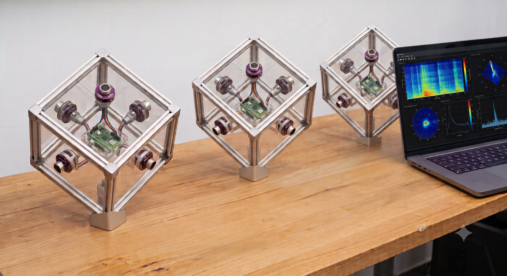

# het68 — 6-channel I2S USB sound card for Raspberry Pi Pico 2 (RP2350)

<p align="center">
  
</p>

This firmware turns a Raspberry Pi Pico 2 (RP2350) into a 6-channel USB audio
input device (microphone). It captures six independent I2S data lines from six
ICS-43434 MEMS microphones (SEL hardwired GND, left channel only), moves the
samples into memory with DMA, and streams them to the host over USB Audio Class
2.0 (UAC2) using TinyUSB.

## Audio format

| Property | Value |
|---|---|
| Class | USB Audio Class 2.0 (UAC2), isochronous IN |
| Channels | 6 |
| Sample rate | 48 kHz |
| Sample format | 24-bit signed, packed little-endian (`S24_3LE`, 3 bytes/sample) |
| USB packet | 1 ms = 48 × 6 × 3 = 864 bytes (within the 1023-byte full-speed iso limit) |
| Product string | `Pico 6ch Microphone 48k/24` |
| Channel map | `TFC TRR TSL BC RLC RRC` |

Linux prints that map from the UAC2 channel-config bitmap, in ascending bit
order. USB channel 1 is still microphone 1. The names are the closest standard
positions that keep this order (v1.17.0; earlier firmware reported a horizontal
5.1 map, `FL FR FC LFE RL RR`):

| USB ch | Mic | Name | Direction on the cube |
|---|---|---|---|
| 1 | 1 | TFC | north, +35° |
| 2 | 2 | TRR | azimuth 120°, +35° |
| 3 | 3 | TSL | azimuth 240°, +35° |
| 4 | 4 | BC | azimuth 180°, −35° |
| 5 | 5 | RLC | azimuth 300°, −35° |
| 6 | 6 | RRC | azimuth 60°, −35° |

`TRL` would describe microphone 3 more closely, but its bit is below `TRR`, so
Linux would attach it to channel 2. UAC2 has no bottom-front-left or
bottom-front-right position, so channels 5 and 6 use the next higher bits
(`RLC`, `RRC`). The bitmap does not reorder samples.

The host sees a standard 6-channel 48 kHz / 24-bit capture device and can record
all six microphones simultaneously (e.g. with `arecord`, Audacity, Reaper, OBS).

```bash
arecord -D hw:<card>,0 -c 6 -r 48000 -f S24_3LE -d 3 capture.wav
```

## How capture works

- The Pico is the I2S **master**. One PIO state machine generates the shared
  `WS`/`SCK` clocks for all six microphones.
- Six PIO RX state machines (one per mic SD line on GP16/18/20/26/27/28) capture
  serial data. Mics 1–3 use PIO0; mics 4–6 use PIO1 (same clkdiv, started
  together). Each line reads the **left** I2S slot (SEL hardwired GND on modules).
- DMA writes both I2S slots into a continuous ring (the PIO FIFO is never left
  to stall). The USB device task packs the left slot into 24-bit `S24_3LE` frames.

## Hardware wiring (Grove Shield for Pi Pico)

Board: **Seeed Grove Shield for Pi Pico v1.0**. Shield power switch → **3.3 V**
(never 5 V — destroys ICS-43434).

Each microphone needs **two** 4-pin Grove cables (clock + data). **Cable colours are
the same on every cable** — only the shield socket and mic socket change.

### Grove 4-pin cable — wire colours

| Pin | Wire colour | Usual name |
|-----|-------------|------------|
| **1** | **white** | signal (lower-number pin) |
| **2** | **yellow** | signal (higher-number pin) |
| **3** | **red** | VCC (3.3 V from shield) |
| **4** | **black** | GND |

On the mic breakout, strap **SEL → GND** (left channel only). The **yellow** wire
(pin 2) on the **data** cable is not connected on the module.

### Wiring overview

```
Shield                          Each mic module (×6)
────────                        ────────────────────
[UART0]─────── Debug Probe      (no mic cable)
[UART1]──clock──► Mic1 CLK IN ──► CLK OUT ──► Mic2 ──► Mic3
[I2C0]──clock───► Mic4 CLK IN ──► CLK OUT ──► Mic5 ──► Mic6
[D16]──data─────► Mic1 DATA
[D18]──data─────► Mic2 DATA
[D20]──data─────► Mic3 DATA
[A0]──data──────► Mic4 DATA
[A1]──data──────► Mic5 DATA
[A2]──data──────► Mic6 DATA
[I2C1]────────── PS1240 piezo (no mic)
```

### Clock cable (7× Grove cable — same colours on every clock cable)

From shield into **CLK IN** on mic 1 (branch A) and mic 4 (branch B); daisy-chain
**CLK OUT → CLK IN** along each branch. **Do not use red (pin 3)** on clock cables.

| Pin | Wire | Shield / mic signal | GPIO |
|-----|------|---------------------|------|
| 1 | **white** | **SCK** | GP9 |
| 2 | **yellow** | **WS** | GP8 |
| 3 | red | *not used* | — |
| 4 | **black** | **GND** | GND |

| Branch | Plug shield clock socket into | Then daisy-chain |
|--------|------------------------------|------------------|
| Mics 1–3 | **UART1** | Mic1 → Mic2 → Mic3 |
| Mics 4–6 | **I2C0** | Mic4 → Mic5 → Mic6 |

*(UART1 and I2C0 are the same GP8/GP9 on the PCB — two sockets, one clock bus.)*

### Data cable (6× Grove cable — identical colours on every mic)

Plug shield end into the port in the **Mic** column; plug mic end into **DATA**.
Use **pin 1 (white)** for SD on analog ports A0–A2 (do not use pin 2 there).

| Pin | Wire | Mic module (ICS-43434) | Shield port |
|-----|------|------------------------|-------------|
| 1 | **white** | **SD** (serial data) | see table below |
| 2 | yellow | *not used* (SEL = GND on PCB) | — |
| 3 | **red** | **VDD** (3.3 V) | same socket |
| 4 | **black** | **GND** | same socket |

| Mic | USB ch | Shield **data** socket | SD GPIO (pin 1 white) |
|-----|--------|------------------------|------------------------|
| 1 | 1 | **D16** | GP16 |
| 2 | 2 | **D18** | GP18 |
| 3 | 3 | **D20** | GP20 |
| 4 | 4 | **A0** | GP26 |
| 5 | 5 | **A1** | GP27 |
| 6 | 6 | **A2** | GP28 |

**Analog ports A0–A2:** the shield ties A0 pin 2 to A1 pin 1 (GP27) and A1 pin 2
to A2 pin 1 (GP28). Use only **pin 1 (white)** on each port — one mic per socket.

### Debug UART — Grove **UART0** → Raspberry Pi Debug Probe

| Pin | Wire | GPIO | Signal | → Probe connector **U** |
|-----|------|------|--------|-------------------------|
| 1 | **white** | GP1 | UART RX | ← Probe **TX** (orange) |
| 2 | **yellow** | GP0 | UART TX | → Probe **RX** (yellow) |
| 3 | red | — | not used | — |
| 4 | **black** | GND | ground | GND |

Baud rate: **115200** (`./serial.sh`).

### Sync beacon — Grove **I2C1** → PS1240 piezo

Passive piezo between the two signal wires. **Do not use red or black** on this cable.

| Pin | Wire | GPIO | Signal |
|-----|------|------|--------|
| 1 | **white** | GP7 | Piezo B |
| 2 | **yellow** | GP6 | Piezo A |
| 3 | red | — | not used |
| 4 | black | — | not used |

### GPIO quick reference

| Grove port | Function | GPIO |
|------------|----------|------|
| **UART0** | Debug UART | GP0 TX, GP1 RX |
| **UART1** | Clock branch mics 1–3 | GP9 SCK, GP8 WS |
| **I2C0** | Clock branch mics 4–6 | GP9 SCK, GP8 WS |
| **I2C1** | Piezo beacon | GP6, GP7 |
| **D16 / D18 / D20** | Mic 1–3 SD | GP16 / GP18 / GP20 |
| **A0 / A1 / A2** | Mic 4–6 SD (pin 1) | GP26 / GP27 / GP28 |
| *(header)* | Grove DPS310 barometer (optional) | **GP2 SDA / GP3 SCL** (I2C1) |

### Barometer — Grove DPS310 (optional, v1.2.1+)

**Seeed 101020812** Infineon DPS310 (300–1200 hPa, −40–85 °C). Wire to free
header pins **GP2 (SDA) / GP3 (SCL)** + 3V3/GND — **not** to shield I2C0/I2C1
(those are mic clocks / piezo). Firmware probes `0x77` then `0x76`; if the pins
are busy or no device answers, baro is skipped. CLI: `BARO` (aliases `DPS`,
`PRESSURE`); also in `STATUS`, boot dump, and heartbeat (`baro=…hPa`).
**v1.2.3:** moist-air speed of sound (Cramer/NPL-style) from DPS310 **T+P**
and assumed **RH** (default 50 %, set with `BARO RH <0-100>`):
Arden-Buck \(p_{sat}\), \(x_w=RH\cdot p_{sat}/p\), then
\(c=331.36\sqrt{T_K/273.15}\,(1+0.314 x_w+0.037 x_w^2)\).
Shown as `SOUND c=…` / `BARO … c=…`; fed into DOA TDOA (default 343 m/s
without baro). Details: [`wiring_and_bom.md`](wiring_and_bom.md),
[Seeed wiki](https://wiki.seeedstudio.com/Grove-High-Precision-Barometric-Pressure-Sensor-DPS310/).

BOM and module layout: `wiring_and_bom.md`.

## Drone detection (DOA + sync beacon)

Alongside the USB sound card the firmware runs an autonomous acoustic front-end:

* **Drone-only DOA with CLI + DET log (v1.6.0).**
  core1 classifies drones only. The low-frequency wind energy still gates the
  drone band, but wind, vehicles, birds and walkers are not tracked or logged.

  | Class | Band | Cue | Tracks |
  |---|---|---|---|
  | **drone** | ~800 Hz–6 kHz | continuous, **wind gate kept**, crest limit | up to **2** |

  **Entity gallery** (`entity_store`) = classification templates (ACID dual-slot,
  last two flash sectors). **Detection log** (`detection_log`) = timed events in a
  **separate** flash region (two sectors below the gallery) with `first_seen`,
  `last_seen`, `occurrence`, `max_gap_ms`. DET timestamps are written **only after**
  `TIME SYNC <unix>` since boot. `DET EXPORT` emits **JSON Lines** (`NVREVT`) for
  smart-NVR event correlation.

  UART **CLI** (help on boot / first byte / USB mount): `HELP`, `STATUS`,
  `TIME` / `TIME INFO` / `TIME SYNC`, `LOG ON|OFF`,
  `DET LIST|EXPORT|BACKUP|IMPORT|DEL|CLEAR`, `ENT LIST|EXPORT|IMPORT`,
  `DRONE LIST|CLEAR`, `BARO`, `LINK`, `RID LIST|ON|OFF`. See [`TEST_SCENARIOS_1.0.6.md`](TEST_SCENARIOS_1.0.6.md).

* **Acoustic node link (v1.4.0+).** Nodes talk over the existing GP6/GP7 PS1240
  piezo with a **fast FHSS PHY**: 31-chip BPSK preamble at 4 kHz (CDMA) plus
  **non-coherent 2-FSK** data on an 8-tone hop set (~3–5.4 kHz). One frame is
  **~70 ms on air** (&lt; 100 ms budget; v1.3 was ~7 s and wire-incompatible).
  Fixed 31-byte frame + CRC32 (no Hamming); reserved crypto fields for future
  AEAD. RX uses the 6-mic 48 kHz mono mix. Features: **SS-TWR ranging** (baro
  \(c\)), **coarse time sync** (`TIME` source `acoustic`), `BEACON` / `DETECT` /
  `CTRL` (`WIFI_WAKE`). UART: `LINK`, `LINK ID <0-7>`, `LINK BEACON`, `LINK WIFI`.
  FAQ: [`wiki.md`](wiki.md) / [`wiki.cs.md`](wiki.cs.md). Protocol:
  [`chirp.md`](chirp.md) / [`chirp.cs.md`](chirp.cs.md).

* **OpenDroneID / EU Direct Remote ID (v1.1.0+).** On CYW43 boards
  (`PICO_BOARD=pico2_w`, `pimoroni_pico_plus2_w_rp2350`, or other Pico 2 W
  variants) the
  firmware scans BLE advertisements for service UUID `0xFFFA` and parses ASTM
  F3411 Basic ID + Location + **System** messages (e.g. Dronetag / built-in RID).
  Tracks show up in the heartbeat as `rid=N`, via `RID LIST`, and as DET class
  `remoteid`. **v1.1.1:** System-message timestamp (ODID 2019 epoch → Unix)
  auto-applies `TIME SYNC` when unsynced or when drift ≥ 2 s (rate-limited), so
  DET timestamps work without a UART `TIME SYNC`. **v1.1.2:** `TIME INFO`
  reports sync **source / age / quality**; known drones (+ RID fields) persist
  in a flash ACID store (`DRONE LIST`); `STATUS` dumps all stored data and
  statistics (also printed on boot). **v1.2.1:** optional Grove **DPS310**
  barometer on GP2/GP3 (`BARO`). Non-wireless `pico2` builds compile a stub
  for RID. Flash end layout: DRONE / BT TLV / DET / ENT (two sectors each).
  **v1.2.5:** with `LOG ON`, UART prints `CMP` lines comparing microphone DOA
  az/el to RID GPS az/el (local ENU from System-message operator lat/lon).
  **v1.2.6:** documents the `CMP` field abbreviations (see below).
  **v1.2.7:** release CI Node 24 actions, fixed `openocd` submodule mapping;
  release assets include `SHA256SUMS.txt` (+ signing placeholders — see
  [`signing/README.md`](signing/README.md)).
  **v1.5.0:** default array edge **384 mm** (was 512 mm). Rebuild existing 512 mm
  cubes with `HET68_DOA_EDGE_MM=512`.
  **v1.5.1:** release CI pins `HET68_DOA_EDGE_MM=384` and ignores a stale Google
  Chrome apt source that was failing `apt-get update` on GitHub runners.
  **v1.6.0:** UART debug lines end with CR+LF so minicom returns to column 0.
  Heartbeat is 3 Hz. Acoustic classification is drones only.
  **v1.7.0:** `HB OFF` stops the periodic heartbeat (`HB ON` resumes it).
  A tone inside the drone band (~800 Hz–6 kHz; use **2000 Hz**) is reported
  even when the microphones are not on the cube (`pos=band`). A geometric
  lock, when the array matches the model, is `pos=tdoa`.
  **v1.8.0:** USB capture no longer drops out while the UART heartbeat or DOA
  log is printing. I2S DMA runs as an endless ring, and debug text is queued
  so the main loop can keep servicing isochronous IN.
  **v1.9.0:** debug logging is on after every reboot (`HB` and `LOG`). The
  first console line is `het68 <version>  build <YYYY-MM-DD HH:MM:SS>  debug=on`.
  The same line is repeated when the USB serial port is opened. Enter in
  minicom submits a command. Debug is mirrored to the Pico USB CDC port as
  well as the probe UART.
  **v1.10.0:** default detection cube edge is **128 mm** (was 384 mm). The
  longest baseline is then one edge, so a 2 kHz tone stays inside a single
  spatial period. `DOA_MAXLAG` still follows the edge.
  **v1.11.0:** DJI Neo 2 gate. Direction uses 400 Hz–2.5 kHz (blade-pass
  500–1400 Hz). A distant vacuum near 70–130 Hz, and a blade-rate that is
  only a harmonic of that tone, is logged as `VAC` and is not a drone.
  **v1.12.0:** Neo 2 is reported only for a sharp blade line at 0.9–1.36 kHz
  whose level and prominence match a real motor, and whose phase across the
  cube fits one direction. Three agreeing windows are required. A vacuum
  harmonic and a weak or jumping lock are not a drone.
  **v1.13.0:** one drone track. A fix is kept only when the phase fit is at
  least 0.75, and the published azimuth and elevation are the median of the
  last agreeing fixes. A noisy window holds the last bearing instead of
  opening a second track. A distant hover (RMS about 60) still counts when
  the blade line is sharp.
  **v1.14.0:** direction from wideband SRP-PHAT (600 Hz–8 kHz, 0.25 s memory,
  `neo_srp.c`) instead of the phase of the blade line. On one frequency the
  direct sound and its echoes merge into one wrong bearing. Across the band the
  ground reflection shows up as its own peak below the drone. The track
  follows its own peak, never steps onto that ground image, and moves to
  another peak only after 1 s of 1.4× stronger evidence. The vacuum veto now
  needs a tonal 70–130 Hz hum at least as strong as the blade line, so
  ordinary outdoor hum no longer drops a distant drone. `SRC` adds `q=`, the
  SRP coherence of the tracked peak.
  **v1.15.0:** releases and local builds are RP2350 only (Pico 2, Pico 2 W,
  Pico Plus 2 W). Pico and Pico W (RP2040, 264 KB RAM) are no longer built;
  the SRP tables do not fit there. The detector itself is unchanged from 1.14.0.
  **v1.16.0:** the Pico's own USB serial port carries bytes again. The CDC
  data interface is number 3, but the configuration claimed only three
  interfaces, so the host never opened the bulk endpoints. `TIME SYNC` on
  that port now reaches the CLI. Release builds keep the CDC mirror on.
  **v1.17.0:** the USB channel map follows the detection cube:
  `TFC TRR TSL BC RLC RRC` (was the horizontal 5.1 map `FL FR FC LFE RL RR`).
  Channel 1 is still microphone 1. See the table under Audio format.

  ```
  SRC class=drone id=0 az=137.4 el=22.8 conf=0.7 lvl=-31.2dB
  CMP mic_id=0 mic_az=137.4 mic_el=22.8 | rid_id=UAV123 rid_az=140.1 rid_el=21.0 d_az=-2.7 d_el=1.8 rid_rng=85.0m
  DET id=3 class=drone first=1720000000 last=1720000012 occ=8 max_gap_ms=400 az=137.4 el=22.8
  TRACKS drone=1 entity=0
  ```

  `CMP` field meanings (mic = acoustic DOA, rid = OpenDroneID BLE GPS):

  | Field | Meaning |
  |-------|---------|
  | `CMP` | Compare: mic DOA vs RID position in the same az/el frame |
  | `mic_id` | Acoustic drone track index (0…) |
  | `mic_az` / `mic_el` | Mic DOA azimuth / elevation (degrees). Azimuth 0° = array +X (mic 1 / north), elevation 0° = horizon |
  | `rid_id` | UAS ID from RID Basic ID (or `?` if unknown) |
  | `rid_az` / `rid_el` | RID aircraft lat/lon/alt → local az/el relative to System-message **operator** origin (same frame as DOA) |
  | `d_az` / `d_el` | Difference mic − rid (degrees); `d_az` wrapped to ±180° |
  | `rid_rng` | Slant range from operator origin to aircraft (metres) |

  If the System origin is missing, `CMP` may print RID `lat`/`lon` with `(no origin)` instead of az/el.
  If only RID is present (no acoustic drone), the line starts with `CMP mic=none | …`.

  - Species / ICE·EV / wind direction / re-ID are best-effort heuristics
    (v1.0.7: soft score bands, gait regularity, ambiguity→generic bird, tighter
    cross-class gates). Still not a trained model.
  - Walker tracking assumes **one** walking entity at a time.

* **Array geometry.** A cube standing on a vertex, **128 mm** edge (v1.10.0+;
  v1.5.0–v1.9.0 used 384 mm).
  Mics 1–3 are the three upper faces (mic 1 = north, then +120°, +240° azimuth,
  all at +35.26° elevation); mics 4–6 are the opposite lower faces (−35.26°
  elevation, azimuths interleaved by 60°). The USB channel map names those
  positions `TFC TRR TSL BC RLC RRC` (see Audio format). Select the edge at
  build time with any
  integer size — `HET68_DOA_EDGE_MM=384 ./build.sh` (default **128 mm**);
  `DOA_MAXLAG` and the comparison window derive from it automatically. How to
  physically build the cube, what to build it from, and a full edge-length
  trade-off analysis (accuracy, speed, compute, memory) are in
  [`array_cube_design.md`](array_cube_design.md).

* **Synchronisation / node beacons.** The PS1240 is driven differentially on
  GP6/GP7. From v1.4.0 the acoustic link owns short FHSS chirps (~70 ms); a rare
  idle PN keepalive may still bump `bcn=` in the heartbeat.

## Downloads

Pre-built firmware for each tagged release is published on GitHub Releases:

**https://github.com/fedurca/het68/releases**

Create a GitHub Release whose tag is SemVer core ([semver.org](https://semver.org/))
— `x.y.z` or `vx.y.z` (e.g. `1.2.4` / `v1.2.4`) — and CI builds firmware for
**pico2**, **pico2_w** (RP2350 + CYW43439 Wi‑Fi/BT), and
**Pico Plus 2 W**. Pico and Pico W are not built. CI then
attaches `.uf2` / `.elf` assets plus **`SHA256SUMS.txt`** and **`SIGNING.txt`**
(reserved for future detached signatures; see [`signing/README.md`](signing/README.md)).

```bash
# after downloading assets from a release:
sha256sum -c SHA256SUMS.txt
```

## Build

The Pico SDK is cloned locally into `./pico-sdk` (gitignored); no environment
variables are required. On a fresh checkout:

```bash
./scripts/fetch_pico_sdk.sh   # Pico SDK 2.2.0 + TinyUSB submodule
./build.sh
```

See `BUILDING.md` for details.

### Target board

The default board is `pico2` (Raspberry Pi Pico 2, RP2350A, 4 MB flash, no PSRAM).
Select a different board with `PICO_BOARD`:

```bash
./build.sh                                          # default: pico2
PICO_BOARD=pico2_w ./build.sh                       # Pico 2 W: RP2350A + CYW43439 Wi-Fi/BT
PICO_BOARD=pimoroni_pico_plus2_w_rp2350 ./build.sh  # 16 MB flash, 8 MB PSRAM, Wi-Fi/BT
```

| Board | `PICO_BOARD` | Notes |
|---|---|---|
| Pico 2 | `pico2` | RP2350A, 4 MB flash, no wireless |
| **Pico 2 W** | **`pico2_w`** | RP2350A + **CYW43439** Wi‑Fi/BT (OpenDroneID) |
| Pico Plus 2 W | `pimoroni_pico_plus2_w_rp2350` | RP2350B, 16 MB flash, 8 MB PSRAM, Wi‑Fi/BT |

Pico and Pico W (RP2040) are not supported from v1.15.0. The detector's static
tables need more than 264 KB of SRAM.

The **Pimoroni Pico Plus 2 W** (RP2350B) is the recommended upgrade for multi-node
work: 16 MB flash, 8 MB PSRAM (headroom for recording / on-device detection), and
2.4 GHz Wi-Fi + Bluetooth for networking nodes. Official **Pico 2 W** is the
drop-in wireless Pico 2 (same 4 MB flash, CYW43439). Boards whose LED lives on a
wireless module do not define `PICO_DEFAULT_LED_PIN`, so the heartbeat LED is
skipped there (the UART heartbeat still runs). Rationale, PSRAM sizing, power
(all these boards are 3.3 V designs; USB needs 3.3 V `USB_OTP_VDD`, so a
fully-1.8 V node is custom-hardware only), and alternatives are in
[`array_cube_design.md`](array_cube_design.md).

### TinyUSB / pico-sdk patches

Upstream **Pico SDK 2.2.0** (commit `a1438dff`) ships **TinyUSB 0.18.0**, which
does not yet contain all fixes needed for stable RP2350 UAC2 6-channel streaming.
This repo carries local patches under [`patches/`](patches/) — full rationale and
per-fix notes are in [`PATCHES.md`](PATCHES.md).

| What | Where |
|---|---|
| Patch script | [`patches/apply_all.py`](patches/apply_all.py) |
| Detailed fix list | [`PATCHES.md`](PATCHES.md) |
| Reference `.patch` (ISO activate, PR 2937) | [`patches/tinyusb-0.18.0-pr2937-iso-activate.patch`](patches/tinyusb-0.18.0-pr2937-iso-activate.patch) |

**What they fix (summary):**

- RP2350 USB device controller quirks (`EP_ABORT` spin, NULL EP0 control register)
- `-O3` undefined behaviour from `TU_VERIFY` / `TU_ASSERT` in TinyUSB audio/stack code
- UAC2 enumeration race on Linux (`SET_INTERFACE` vs. first ISO IN packet, `err -110`)
- ISO endpoint busy-flag handling after abort

**How to apply:**

Patches are applied **automatically** on every `./build.sh` run (idempotent: reset
patched files to git HEAD inside `pico-sdk/lib/tinyusb`, then re-apply). To apply
manually:

```bash
python3 patches/apply_all.py
```

Expected output ends with `✓ All patches OK`. Do **not** edit files under
`pico-sdk/` by hand — add changes to `patches/apply_all.py` or a patch file instead.

**Target SDK version:** patches are written and tested against the vendored tree
**Pico SDK 2.2.0** / **TinyUSB 0.18.0** (`pico-sdk/lib/tinyusb`). After upgrading
the SDK submodule, re-run `apply_all.py` and check for `[pattern not found]` errors;
see `PATCHES.md` for upstream-overlap notes (some fixes may already be merged).

```bash
./build.sh
```

This produces `build/pico_6mic_soundcard.uf2` (and `.elf`). The default board is
`PICO_BOARD=pico2`.

* **Bench test without microphones** — build the diagnostic firmware, which
  bypasses I2S and streams a simulated 1 kHz tone on all channels:

```bash
HET68_USB_DIAG=ON ./build.sh
```

## Flash

Download a pre-built `.uf2` / `.elf` from
[GitHub Releases](https://github.com/fedurca/het68/releases), or build locally
(`./scripts/fetch_pico_sdk.sh && ./build.sh`).

* **Via Raspberry Pi Debug Probe (SWD), recommended for the lab setup:**

```bash
./fixdebugger.sh           # frees the USB bus, then flashes the ELF over SWD
./fixdebugger.sh --test    # also runs a short arecord smoke test
```

* **Via UF2 / BOOTSEL:** hold `BOOTSEL` while plugging in the Pico, then copy
  `build/pico_6mic_soundcard.uf2` (or the versioned asset from the release) to
  the `RP2350` mass-storage volume.

## Lab capture

10-second 6-channel reference recording (stops PipeWire so `arecord` can open the
device directly):

```bash
./record10s.sh                  # -> /tmp/lab_6ch_10s.wav
./record10s.sh capture.wav      # custom path
```

Local 3D view of the detection cube (default edge **128 mm**, same geometry as
`doa.c`). Direction is GCC-PHAT below each pair's grating frequency, then the
firmware TDOA solve. A harmonic comb in the Neo 2 blade-pass band (500–1400 Hz,
the host estimator from `het68_spectral`) is what labels the source a drone.
A single node draws that drone on the direction ray; the distance is the
display radius, not a measured range. Build the matching firmware with
`HET68_DOA_EDGE_MM=128 ./build.sh`.

```bash
./detect_local.py --self-test
./detect_local.py --demo                 # synthetic drone, no sound card
./detect_local.py                        # live Pico 6ch USB input
./detect_local.py --wav capture.wav
./detect_local.py --uart /dev/ttyACM0    # plot firmware SRC lines
```

## Usage

After reset the Pico enumerates as a standard 6-channel 48 kHz / 24-bit USB audio
device on Windows, macOS and Linux. Select it as the input device in any audio
application and record from all six microphones at once.

## License

Copyright (C) 2025-2026 het68 project contributors.

This program is free software: you can redistribute it and/or modify it under the
terms of the **GNU General Public License v3.0** as published by the Free Software
Foundation. This program is distributed WITHOUT ANY WARRANTY; without even the
implied warranty of MERCHANTABILITY or FITNESS FOR A PARTICULAR PURPOSE. See the
full license text in [`LICENSE`](LICENSE) or <https://www.gnu.org/licenses/gpl-3.0.html>.

Note: the vendored `pico-sdk/` and the TinyUSB patches under `patches/` carry their
own upstream licenses (BSD-3-Clause / MIT) and are not covered by this project's GPLv3.
