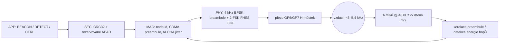

# Akustická synchronizace a spojení mezi nody ("chirp")

Jazyk: [English](chirp.md) · **Čeština**

Tento dokument popisuje, jak spolu nody het68 komunikují, synchronizují si hodiny
a měří vzájemnou vzdálenost přes palubní **piezo PS1240** (GP6/GP7) a
**pole 6 mikrofonů se vzorkováním 48 kHz** — spojení "chirp".

**Firmware v1.4.0** předělal PHY tak, aby **jeden rámec trval ~70 ms na vzduchu**
(rozpočet: **&lt; 100 ms**), s frekvenčním hoppingem kolem rezonance PS1240 místo
v1.3 burstu DSSS ~7 s (příliš pomalé a pro ucho nepříjemné).

Zdroje: [`acoustic_link.c`](acoustic_link.c), [`node_store.c`](node_store.c),
[`buzzer.c`](buzzer.c). FAQ přehled: [`wiki.cs.md`](wiki.cs.md) /
[`wiki.md`](wiki.md).

- Cíle: multi-node provoz, vzájemná sync času, ranging, použitelný air-time,
  menší tónová otravnost na stejném piezohardware.
- Omezení (viz [`AGENTS.md`](AGENTS.md)): žádné `malloc`/`free` v realtime audio
  cestě, žádné blokování v IRQ/DMA/USB callbackách, ohraničené statické buffery.

> **Nekompatibilita na drátě:** v1.4 používá `ALINK_VERSION = 2`. **Není**
> interoperabilní s v1.3.x (`version = 1`, Hamming + pomalé DSSS).

---

## 1. Signálová cesta

- **TX**: PS1240 diferenciálně z GP6/GP7 (`buzzer.c`). Dwell čipu je pevných
  **250 µs**; PWM nosná se může přeladit každý čip (`buzzer_tx_chips_fh`).
- **RX**: [`main.c`](main.c) míchá šest miků do `acoustic_link_rx_push()`;
  `acoustic_link_poll()` běží matched filter ohraničeně v main loopu.

---

## 2. Fyzická vrstva (PHY) — v1.4

| Parametr | Symbol | Hodnota |
|---|---|---|
| Vzorkovací frekvence | `ALINK_FS_HZ` | 48000 Hz |
| Dwell čipu | `ALINK_CHIP_US` | **250 µs** |
| Vzorků na čip | `ALINK_SAMPLES_CHIP` | 12 |
| Nosná preambule | `ALINK_PREAMBLE_HZ` | 4000 Hz (rezonance PS1240) |
| Délka preambule | `ALINK_PREAMBLE_LEN` | **31** čipů (CDMA) |
| Datová modulace | — | **nekoherentní 2-FSK** na hop množině |
| Počet hopů | `ALINK_NHOPS` | 8 |
| Frekvence hopů | `g_hop_hz[]` | 3000, 3400, 3800, 4000, 4200, 4600, 5000, 5400 Hz |
| Data SF | `ALINK_DATA_SF` | 1 čip / bit |
| Nody | `ALINK_MAX_NODES` | 8 |
| Čipů na rámec | `ALINK_TX_CHIPS` | **279** (= 31 + 248) |
| **Air-time** | — | **279 × 250 µs = 69,75 ms** |

### Proč FHSS + 2-FSK (ne BPSK na hopu)

Přeladění PWM wrapu každý čip **resetuje fázi nosné**, takže koherentní BPSK na
hopujících tónech je nespolehlivé. Datové bity proto volí jeden ze dvou hop tónů
(offset `NHOPS/2`); přijímač porovnává nekoherentní energii.
**Preambule zůstává BPSK na pevných 4 kHz** kvůli CDMA akvizici a ToA.

### Kódy preambule (CDMA)

M-sekvence délky 31 (`x^5 + x^2 + 1`) s různými kruhovými posuny podle
`node_id` (krok 3). Akvizice koreluje I/Q na 4 kHz proti všem 8 kódům.

### Idle keepalive piezа

Volně běžící PN burst buzzeru je vzácný (~30 s) a krátký (31 × 250 µs). Skutečný
provoz mezi nody řídí beacon schedule acoustic linku.

---

## 3. Formát rámce

Stále pevných **31 bajtů** plaintextu (API/layout stejný); FEC expanze pryč.

| Offset | Pole | Bajtů |
|---|---|---|
| 0 | verze (`ALINK_VERSION` = **2**) | 1 |
| 1 | node_id (odesílatel) | 1 |
| 2 | type (BEACON/DETECT/CTRL/ACK) | 1 |
| 3 | seq | 1 |
| 4 | flags | 1 |
| 5 | key_id (crypto, rezervováno) | 1 |
| 6..9 | nonce (LE32, rezervováno) | 4 |
| 10 | len (0..16) | 1 |
| 11..26 | payload (doplněno na 16) | 16 |
| 27..30 | CRC32 LE přes 0..26 | 4 |

- Na vzduchu: **248 raw bitů** (bez Hammingu) po 31čipové preambuli.
- Crypto pole zůstávají napojená na stub `crypto_seal` / `crypto_open`.

### Payload BEACON (stejná sémantika)

| Off | Obsah |
|---|---|
| 0..3 | `tx_mono` LE32 |
| 4..7 | Unix epocha LE32 (0 pokud nesync) |
| 8 | `echo_node` (nebo `0xFF`) |
| 9..12 | `t_reply` LE32 |
| 13 | `echo_seq` |
| 14 | synced bajt |
| 15 | pad |

---

## 4. Vícenásobný přístup

1. **CDMA preambule** — různé posuny oddělují překryté akvizice.
2. **Per-node hop base** — páry tónů offsetované `node_id * 3`.
3. **Slotted-ALOHA jitter** — majáky každých ~2000 ms + 0..800 ms náhodně.
4. **Listen-before-talk** — žádné TX při `buzzer_tx_busy()`.

---

## 5. Přijímací řetězec

1. Okna po 12 vzorcích z mono ring bufferu.
2. **SEARCH** — mix na 4 kHz, korelace historie 31 proti všem kódům;
   přijetí při `rho > 0.28` + energetický práh.
3. **DATA** — pro každý bit porovnej energii dvou kandidátních hop tónů.
4. 248 bitů → 31 bajtů, CRC32 a `version == 2`, dispatch.

---

## 6. Two-way ranging (SS-TWR)

Algoritmus beze změny ([`node_store.c`](node_store.c)):
\(\mathrm{ToF}=(T_\mathrm{round}-t_\mathrm{reply})/2\),
vzdálenost \(=\mathrm{ToF}\cdot c\) s \(c\) z `doa_c_sound_m_s()`.

Rozlišení čipu je teď **250 µs ≈ 8,6 cm** při \(c \approx 343\,\mathrm{m/s}\)
(dříve ~0,69 m při 2 ms).

---

## 7. Synchronizace času

- Hrubá: peer se `SYNCED` + epochou → převzetí přes `HET68_TIME_SRC_ACOUSTIC` (quality 60).
- Jemná: per-peer `clock_offset_us` z SS-TWR (v `LINK`).

---

## 8. Wi-Fi wake / OTA

`CTRL WIFI_WAKE` stále nastaví `acoustic_link_wifi_wake_pending()`; STA/OTA cesta
je odložená.

---

## 9. CLI

| Příkaz | Akce |
|---|---|
| `LINK` | status (`ver`, `air_ms`, počítadla) + tabulka peerů |
| `LINK ID <0-7>` | nastav acoustic id / CDMA posun |
| `LINK BEACON` | pošli jeden maják |
| `LINK WIFI` | broadcast `WIFI_WAKE` |

Build-time id: `HET68_NODE_ID=3 ./build.sh`.

---

## 10. Air-time a slyšitelnost

| | v1.3.x | **v1.4.0** |
|---|---|---|
| Čipů / rámec | 3599 | **279** |
| Dwell čipu | 2 ms | **0,25 ms** |
| Air-time | ~7,2 s | **~70 ms** |
| Modulace | DSSS-BPSK @ 4 kHz | BPSK preambule + **2-FSK FHSS** |
| FEC | Hamming(7,4) | jen CRC32 |

Duty cyklus při periodě majáku 2 s ≈ **3,5 %** na vzduchu. Hopping rozprostře
energii do ~3–5,4 kHz — spíš krátké tiky/chirpy než dlouhý pískot. Pořád slyšitelné;
netvrdíme ticho.

---

## 11. Omezení a budoucí práce

- Ne plně ověřeno na hardwaru (práh, dosah, pokles SPL mimo rezonanci).
- Bez Hammingu — spoléháme na CRC + časté krátké majáky.
- Extrémní hopy mají slabší SPL.
- Sub-chip interpolace ToA by ještě zpřesnila ranging.
- Crypto / Wi-Fi OTA stále stuby.

---

## 12. Mapa zdrojů

- [`acoustic_link.h`](acoustic_link.h) / [`acoustic_link.c`](acoustic_link.c)
- [`node_store.h`](node_store.h) / [`node_store.c`](node_store.c)
- [`buzzer.h`](buzzer.h) / [`buzzer.c`](buzzer.c) — FHSS chip stream
- [`het68_time.*`](het68_time.h) — zdroj času `acoustic`
- [`main.c`](main.c) / [`cli.c`](cli.c)
