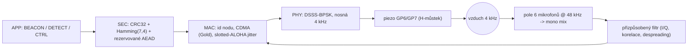
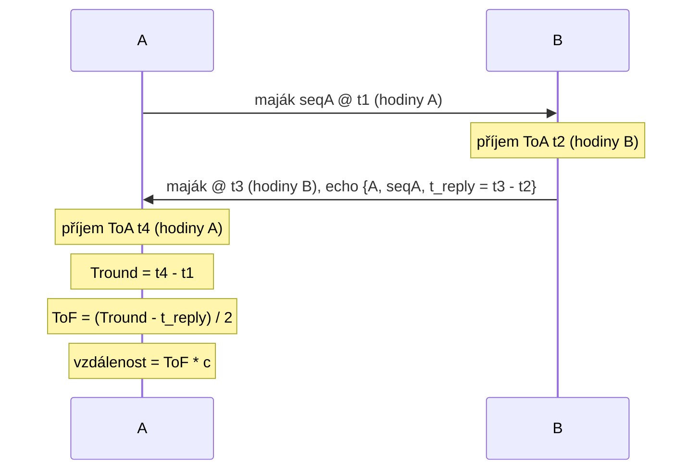

# Akustická synchronizace a spojení mezi nody ("chirp")

Jazyk: [English](chirp.md) · **Čeština**

Tento dokument popisuje, jak spolu nody het68 komunikují, synchronizují si hodiny
a měří vzájemnou vzdálenost přes palubní **4 kHz piezo PS1240** (GP6/GP7) a
**pole 6 mikrofonů se vzorkováním 48 kHz** — spojení "chirp" zavedené ve firmwaru
**v1.3.0** ([`acoustic_link.c`](acoustic_link.c), [`node_store.c`](node_store.c)).

Kratší přehled formou FAQ (UART logování, variabilita rámce, zasazení do
zbytku firmware): [`wiki.cs.md`](wiki.cs.md) / [`wiki.md`](wiki.md).

- Cíle návrhu: odolnost vůči kolizím při provozu více nodů, vzájemná
  synchronizace času, vzájemné měření vzdálenosti, dobrý dosah a co nejmenší
  postřehnutelnost pro lidské ucho.
- Omezení (viz [`AGENTS.md`](AGENTS.md)): žádné `malloc`/`free` v realtime audio
  cestě, žádné blokování v IRQ/DMA/USB callbacích, pouze ohraničené statické
  buffery.

---

## 1. Signálová cesta



- **Vysílání (TX)**: PS1240 je buzeno diferenciálně z GP6/GP7 jako softwarový
  H-můstek (viz [`buzzer.c`](buzzer.c)). Prohození toho, který kanál je invertovaný,
  otočí fázi nosné o 180 st., což je jeden BPSK čip. ISR na čipové frekvenci
  přehrává libovolný buffer čipů (`buzzer_tx_chips`) a v klidu se vrací k
  periodickému PN majáku.
- **Příjem (RX)**: [`main.c`](main.c) smíchá vzorky šesti mikrofonů do mono streamu
  uvnitř `build_usb_frame_from_i2s()` a volá `acoustic_link_rx_push()`. Náročný
  přizpůsobený filtr běží později, po ohraničených dávkách, z
  `acoustic_link_poll()` v hlavní smyčce.

---

## 2. Fyzická vrstva (PHY)

Rozprostřené spektrum s přímou sekvencí (DSSS) s modulací BPSK na nosné 4 kHz.

| Parametr | Symbol | Hodnota |
|---|---|---|
| Nosná | `ALINK_CARRIER_HZ` | 4000 Hz |
| Vzorkovací frekvence | `ALINK_FS_HZ` | 48000 Hz |
| Vzorků na periodu nosné | `ALINK_SAMPLES_CYCLE` | 12 |
| Period nosné na čip | `ALINK_CYCLES_CHIP` | 8 |
| Vzorků na čip | `ALINK_SAMPLES_CHIP` | 96 |
| Čipová rychlost | `ALINK_CHIP_HZ` | 500 čip/s (2 ms/čip) |
| Délka preambule | `ALINK_PREAMBLE_LEN` | 127 čipů |
| Činitel rozprostření dat | `ALINK_DATA_SF` | 8 čipů/bit |
| Počet různých kódů nodů | `ALINK_MAX_NODES` | 8 |

Každý vyslaný čip je fáze (0 nebo 180 st.). BPSK amplituda `a in {+1,-1}` se mapuje
na fázový bit `p = (a < 0)`. Despreader obnoví datový bit `b`, protože

```
1 - 2*(b XOR c) = (1 - 2*b) * (1 - 2*c)
```

takže vynásobením přijatého čipu lokálním kódovým čipem `(1 - 2*c)` a součtem přes
činitel rozprostření vznikne `(1 - 2*b) * SF * kanál`.

### Kódy (CDMA)

Kódy jednotlivých nodů tvoří **rodina Goldových kódů** ze dvou maximálních LFSR
7. řádu (konstrukce z preferovaného páru):

- sekvence A: `x^7 + x^6 + 1`
- sekvence B: `x^7 + x^3 + 1`
- kód nodu: `code_n[k] = A[k] XOR B[(k + n) mod 127]`, mapováno na +/-1.

**Preambule** je celý 127-čipový kód odesílatele (slouží k akvizici, identitě
odesílatele a k času příchodu). **Rozprostírací kód dat** je prvních `SF` čipů
téhož kódu. Různé nody se tak oddělí na korelátoru (kódový multiplex, CDMA), což
umožňuje přežít současné vysílání více nodů.

> Poznámka: optimalita zvoleného preferovaného páru těchto dvou polynomů není
> laboratorně ověřena; oddělení nodů se opírá i o MAC vrstvu (níže).

---

## 3. Formát rámce

Pevný 31bajtový rámec (nešifrovaná data) drží konstantní velikost pro RX.

| Offset | Pole | Bajty |
|---|---|---|
| 0 | verze (`ALINK_VERSION` = 1) | 1 |
| 1 | node_id (odesílatel) | 1 |
| 2 | typ (BEACON/DETECT/CTRL/ACK) | 1 |
| 3 | seq | 1 |
| 4 | flags (encrypted / ack-req / synced) | 1 |
| 5 | key_id (krypto, rezervováno) | 1 |
| 6..9 | nonce (krypto, rezervováno, LE32) | 4 |
| 10 | len (délka payloadu 0..16) | 1 |
| 11..26 | payload (doplněno na 16) | 16 |
| 27..30 | CRC32 přes bajty 0..26 (LE) | 4 |

- **FEC**: každý bajt se rozdělí na dva nibbly, každý zakódovaný pomocí
  **Hamming(7,4)** (oprava jedné chyby). 31 bajtů -> 62 nibblů -> 434 kódovaných
  bitů (`ALINK_CODED_BITS`).
- **Integrita**: CRC32 (polynom IEEE 802.3 `0xEDB88320`, stejný jako u flash
  úložišť).
- **Připraveno na šifrování**: příznak `encrypted` plus `key_id`/`nonce` jsou
  napojené na háčky `crypto_seal()` / `crypto_open()`. Dnes jde o identitu (no-op);
  cílem je AEAD (encrypt-then-MAC, např. ChaCha20-Poly1305). Protože pole už jsou
  na drátě, pozdější zapnutí šifrování nevyžaduje změnu rámce.

Proud kódovaných bitů se rozprostře na čipy takto: 127 čipů preambule následovaných
`434 * 8 = 3472` datovými čipy, tj. celkem `ALINK_TX_CHIPS = 3599` čipů.

---

## 4. Vícenásobný přístup a odolnost vůči kolizím

1. **CDMA** — různé nody používají různé Goldovy kódy; korelátor obnoví nejsilnější
   zarovnaný kód i při překryvu vysílání.
2. **Slotted-ALOHA jitter** — majáky se plánují každých `BEACON_BASE_MS` (1500 ms)
   plus náhodný `BEACON_JITTER_MS` (0..500 ms), takže periodičtí odesílatelé
   nezůstanou v zákrytu.
3. **Poslech před vysíláním** — `schedule_tx()` odmítne začít nový rámec, když je
   lokální PHY zaneprázdněné (`buzzer_tx_busy()`), takže node nepřepíše vlastní
   vysílání.

Když je node sám, stále vysílá původní periodický PN maják, takže v1.3.0 je v
provozu jediného nodu beze změny chování.

---

## 5. Přijímací řetězec

Běží v `acoustic_link_poll()` a vyprazdňuje SPSC ring plněný přes
`acoustic_link_rx_push()`.

1. **Směšování dolů** — každý mono vzorek se násobí 12prvkovým cos/sin NCO na
   4 kHz, čímž vznikne základní pásmo I/Q. Protože 48000/4000 = 12 je celé číslo a
   96 % 12 = 0, každý čip začíná na stejné fázi NCO.
2. **Integrate-and-dump** — I/Q se akumuluje přes 96 vzorků do jedné komplexní
   hodnoty čipu.
3. **Akvizice** — čip se vloží do 127prvkové kruhové historie a koreluje se
   (komplexně, nekoherentně) proti všem `ALINK_MAX_NODES` kandidátním kódům
   preambule. Normalizovaný vrchol je

   ```
   rho = |corr|^2 / (127 * energie_okna)   v [0, 1]
   ```

   Rámec je detekován, když `rho > DETECT_RHO` (0,30) a energie okna přesáhne
   `DETECT_EMIN`. Vítězný index kódu je odesílatel; fáze korelace dává referenci
   kanálu `(cos phi, sin phi)`; čas čipu je čas příchodu (ToA).
4. **Despreading** — pro každý z 434 datových bitů se sečte `SF` čipů vynásobených
   datovým kódem odesílatele, provede se derotace o `phi` a reálná část se rozhodne
   na bit.
5. **Dekódování** — Hamming dekóduje 434 bitů -> 31 bajtů, ověří CRC32 a verzi a
   pak předá k obsluze. Špatné CRC zvýší `rx_bad_crc` a přijímač se vrátí do
   hledání.

---

## 6. Obousměrné měření vzdálenosti (vzájemná vzdálenost)

Majáky slouží zároveň jako měřicí pakety. het68 používá **jednostranné obousměrné
měření (SS-TWR)** s broadcast majáky ([`node_store.c`](node_store.c)):



- `A` si pamatuje čas vyslání `t1` každého ze svých nedávných majáků
  (`node_store_note_tx`, 8prvkový ring podle seq). Přesné `t1` je čas vyslání
  preambule z `buzzer_tx_start_us()`.
- `B` ve svém dalším majáku echem odkáže naposledy slyšený peer: `echo_node`,
  `echo_seq` a dobu obrátky `t_reply = teď - poslední_rx` (`node_store_pending_echo`).
- Když `A` uslyší maják, jehož `echo_node == A` a `echo_seq` odpovídá čekajícímu
  dotazu, spočítá `ToF` a poté `vzdálenost = ToF * c`.
- **c** je aktuální rychlost zvuku z modelu DPS310 (`doa_c_sound_m_s()`), takže
  měření sleduje teplotu/tlak/vlhkost.
- Kontrola smysluplnosti: `0 <= ToF < 600 ms` (~200 m); jinak se vzorek zahodí.

Odvozuje se i hrubý relativní posun hodin:
`offset(A-B) = t4 - t3 - ToF`, kde `t3` je časové razítko vyslání peeru přenášené v
payloadu.

---

## 7. Synchronizace času

Dvě úrovně:

- **Hrubá (epocha).** Synchronizovaný node inzeruje `flags.SYNCED` a vkládá svou
  unixovou epochu do payloadu majáku. **Nesynchronizovaný** node ji přijme přes
  `het68_time_sync_from(epoch, HET68_TIME_SRC_ACOUSTIC, quality=60)`. `TIME` /
  `TIME INFO` pak hlásí zdroj `acoustic`, vedle stávajících `uart` a `rid`
  ([`het68_time.h`](het68_time.h)). Časová razítka DET logu tak fungují i na nodech,
  které nikdy nedostaly čas přes UART ani OpenDroneID.
- **Jemná (offset).** Výměna SS-TWR poskytuje per-peer `clock_offset_us` (viz
  kapitola 6), který kvantifikuje zbytkový posun mezi sousedy a lze jím později
  řídit lokální fázově dorovnávaný odhad.

Kvalita akustické epochy (60) je záměrně nižší než UART/RID, aby přímý zdroj času
vždy vyhrál.

---

## 8. Probuzení Wi-Fi / OTA (řídicí rovina -> datová rovina)

Akustické spojení je nízkorychlostní **stále zapnutá řídicí rovina**. Pro objemná
data nebo upgrade firmwaru může předat řízení Wi-Fi:

- Rámec `CTRL` s podtypem `WIFI_WAKE` nese rendezvous token.
- Po přijetí desky s CYW43 (`pico_w`, `pico2_w`, Pico Plus 2 W) nastaví požadavek
  na spuštění Wi-Fi (`HET68_WIFI_WAKE=1`); aplikační vrstva dotazuje
  `acoustic_link_wifi_wake_pending()` a řídí připojení STA + objemnou synchronizaci
  / OTA. Na bezdrátově nevybavené `pico2` se obsluha přeloží jako stub, který jen
  loguje.

> Skutečné připojení STA + přenos OTA je záměrně odloženo: vyžaduje zajištění
> SSID/přihlašovacích údajů a musí koexistovat s instancí `cyw43_arch` pro
> BTstack/RID. Formát na drátě a spouštěč jsou připraveny už teď.

---

## 9. Přehled CLI

Přes ladicí UART (viz [`cli.c`](cli.c)):

| Příkaz | Akce |
|---|---|
| `LINK` | stav spojení + tabulka peerů/vzdáleností |
| `LINK ID <0-7>` | nastav akustické id / CDMA kód tohoto nodu |
| `LINK BEACON` | vyšli teď jeden maják |
| `LINK WIFI` | rozešli řídicí rámec `WIFI_WAKE` |

`STATUS` a boot dump obsahují blok `LINK`:
`node`, `tx`, `rx`, `bad_crc`, `peers`, `wifi_wake`, následovaný tabulkou peerů
(`id`, `rx`, `q`, `dist_m`, `offset_us`, `synced`).

Pevné id nodu lze nastavit i při buildu: `HET68_NODE_ID=3 ./build.sh`.

---

## 10. Rozpočet času na vzduchu a datové rychlosti

- Čip = 2 ms. Preambule = 127 čipů = 254 ms. Data = 3472 čipů = 6,944 s.
  **Jeden rámec ~ 7,2 s** na vzduchu.
- Čistá informace: 31 bajtů/rámec za ~7,2 s ~= 34 info bit/s (z toho payload 16
  bajtů).
- Kadence majáku je tedy fakticky `max(BEACON_BASE_MS, doba rámce na vzduchu)`
  plus jitter.

Jde záměrně o pomalou, robustní řídicí/měřicí rovinu. Pro výměnu robustnosti za
rychlost lze snížit `ALINK_DATA_SF`, zkrátit rámec nebo zvýšit čipovou rychlost
(`ALINK_CYCLES_CHIP`). Velké payloady a OTA patří na Wi-Fi rovinu.

---

## 11. Postřehnutelnost

Spojení zůstává na rezonanci ~4 kHz pieza PS1240 (zvoleno kvůli dosahu), což je v
nejcitlivějším pásmu lidského sluchu, takže **není skutečně neslyšitelné**.
Postřehnutelnost se minimalizuje rozprostřeným spektrem (energie rozprostřená
tence, RX funguje i pod 0 dB SNR díky zisku zpracování), nízkým činitelem využití
a náhodným časováním, takže dávky zní spíš jako slabé cvaknutí/šum než jako tón.

---

## 12. Omezení a budoucí práce

- **Neověřeno na hardwaru**: prahy akvizice, přesnost ToA a volba preferovaného
  páru Goldových kódů jsou nejlepší odhad a vyžadují laboratorní doladění.
- **ToA je dnes v rozlišení čipu** (2 ms ~ 0,69 m). Subčipová interpolace vrcholu
  korelace by měření zpřesnila.
- **SS-TWR** předpokládá reciprocitu; **oboustranné TWR** by vyrušilo posun hodin.
- **Krypto** je no-op stub; napojení skutečného AEAD do `crypto_seal`/`crypto_open`
  zapne příznak `encrypted` beze změny formátu.
- **Wi-Fi** probuzení jen nastaví příznak; cesta připojení STA + OTA je budoucí
  práce.

---

## 13. Mapa zdrojů

- [`acoustic_link.h`](acoustic_link.h) / [`acoustic_link.c`](acoustic_link.c) —
  PHY, rámcování, FEC/CRC, krypto háčky, plánovač TX, přizpůsobený filtr RX,
  obsluha.
- [`node_store.h`](node_store.h) / [`node_store.c`](node_store.c) — tabulka peerů,
  SS-TWR měření, posun hodin.
- [`buzzer.h`](buzzer.h) / [`buzzer.c`](buzzer.c) — PHY pieza + vysílání proudu
  čipů.
- [`het68_time.h`](het68_time.h) / [`het68_time.c`](het68_time.c) — hodiny se
  zdrojem `acoustic`.
- [`main.c`](main.c) — odbočka mono RX + `acoustic_link_poll()` v hlavní smyčce.
- [`cli.c`](cli.c) — příkazy `LINK` + integrace do `STATUS`.
