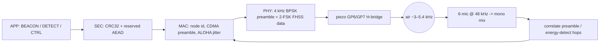

# Acoustic synchronization & node link ("chirp")

Language: **English** · [Čeština](chirp.cs.md)

This document describes how het68 nodes talk to each other, synchronize their
clocks, and measure mutual distance over the on-board **PS1240 piezo**
(GP6/GP7) plus the **6-microphone 48 kHz array** — the "chirp" link.

**Firmware v1.4.0** redesigned the PHY so **one frame is ~70 ms on air**
(budget: **&lt; 100 ms**), using frequency hopping around the PS1240 resonance
instead of the v1.3 ~7 s single-tone DSSS burst (which was too slow and harsh
on the ear).

Sources: [`acoustic_link.c`](acoustic_link.c), [`node_store.c`](node_store.c),
[`buzzer.c`](buzzer.c). FAQ-style overview: [`wiki.md`](wiki.md) /
[`wiki.cs.md`](wiki.cs.md).

- Design goals: multi-node operation, mutual time sync, mutual ranging, usable
  air-time, reduced tonal annoyance on the same piezo hardware.
- Constraints (see [`AGENTS.md`](AGENTS.md)): no `malloc`/`free` in the realtime
  audio path, no blocking in IRQs/DMA/USB callbacks, bounded static buffers.

> **Wire break:** v1.4 uses `ALINK_VERSION = 2`. It is **not** interoperable with
> v1.3.x (`version = 1`, Hamming + slow DSSS).

---

## 1. Signal path

- **TX**: PS1240 driven differentially from GP6/GP7 (`buzzer.c`). Chip dwell is
  fixed at **250 µs**; the PWM carrier may retune every chip (`buzzer_tx_chips_fh`).
- **RX**: [`main.c`](main.c) mono-mixes six mics into `acoustic_link_rx_push()`;
  `acoustic_link_poll()` runs the matched filter in bounded chunks on the main loop.

---

## 2. Physical layer (PHY) — v1.4

| Parameter | Symbol | Value |
|---|---|---|
| Sample rate | `ALINK_FS_HZ` | 48000 Hz |
| Chip dwell | `ALINK_CHIP_US` | **250 µs** |
| Samples per chip | `ALINK_SAMPLES_CHIP` | 12 |
| Preamble carrier | `ALINK_PREAMBLE_HZ` | 4000 Hz (PS1240 resonance) |
| Preamble length | `ALINK_PREAMBLE_LEN` | **31** chips (CDMA) |
| Data modulation | — | **non-coherent 2-FSK** on hop set |
| Hop set size | `ALINK_NHOPS` | 8 |
| Hop frequencies | `g_hop_hz[]` | 3000, 3400, 3800, 4000, 4200, 4600, 5000, 5400 Hz |
| Data SF | `ALINK_DATA_SF` | 1 chip / bit |
| Nodes | `ALINK_MAX_NODES` | 8 |
| Frame chips | `ALINK_TX_CHIPS` | **279** (= 31 + 248) |
| **Air-time** | — | **279 × 250 µs = 69.75 ms** |

### Why FHSS + 2-FSK (not BPSK-on-hop)

Retuning the PWM wrap each chip **resets carrier phase**, so coherent BPSK on
hopping tones is unreliable. Data bits therefore select one of two hop tones
(offset by `NHOPS/2` in the table); the receiver compares non-coherent energy.
The **preamble stays BPSK at fixed 4 kHz** so CDMA acquisition and ToA still work.

### Preamble codes (CDMA)

Length-31 m-sequence (`x^5 + x^2 + 1`) with distinct circular shifts per
`node_id` (step 3). Acquisition correlates I/Q at 4 kHz against all 8 codes.

### Idle piezo keepalive

The free-running buzzer PN burst is rare (~30 s) and short (31 × 250 µs). Real
neighbour traffic is the acoustic-link beacon schedule.

---

## 3. Frame format

Still a fixed **31-byte** plaintext (API/layout unchanged); FEC expansion removed.

| Offset | Field | Bytes |
|---|---|---|
| 0 | version (`ALINK_VERSION` = **2**) | 1 |
| 1 | node_id (sender) | 1 |
| 2 | type (BEACON/DETECT/CTRL/ACK) | 1 |
| 3 | seq | 1 |
| 4 | flags (encrypted / ack-req / synced) | 1 |
| 5 | key_id (crypto, reserved) | 1 |
| 6..9 | nonce (crypto, reserved, LE32) | 4 |
| 10 | len (0..16) | 1 |
| 11..26 | payload (padded to 16) | 16 |
| 27..30 | CRC32 over bytes 0..26 (LE) | 4 |

- On air: **248 raw bits** (no Hamming) after the 31-chip preamble.
- Crypto fields remain wired to stub `crypto_seal` / `crypto_open`.

### BEACON payload (unchanged semantics)

| Off | Content |
|---|---|
| 0..3 | `tx_mono` LE32 |
| 4..7 | Unix epoch LE32 (0 if unsynced) |
| 8 | `echo_node` (or `0xFF`) |
| 9..12 | `t_reply` LE32 |
| 13 | `echo_seq` |
| 14 | synced byte |
| 15 | pad |

---

## 4. Multiple access & collision resistance

1. **CDMA preamble** — distinct shifts separate overlapping acquisitions.
2. **Per-node hop base** — data tone pairs are offset by `node_id * 3`.
3. **Slotted-ALOHA jitter** — beacons every `BEACON_BASE_MS` (2000 ms) +
   0..800 ms random.
4. **Listen-before-talk** — no TX while `buzzer_tx_busy()`.

---

## 5. Receiver chain

1. Buffer 12-sample chip windows from the mono ring.
2. **SEARCH** — mix at 4 kHz, correlate length-31 history vs all node codes;
   accept when `rho > 0.28` and energy gate passes. Winning code ⇒ sender id +
   phase ref + ToA.
3. **DATA** — for each bit index, compare energy of the two candidate hop tones;
   slice the larger as the bit.
4. Pack 248 bits → 31 bytes, verify CRC32 and `version == 2`, dispatch.

---

## 6. Two-way ranging (SS-TWR)

Unchanged algorithm ([`node_store.c`](node_store.c)): broadcast beacons echo
`{peer, seq, t_reply}`; initiator computes
\(\mathrm{ToF}=(T_\mathrm{round}-t_\mathrm{reply})/2\),
\(\mathrm{distance}=\mathrm{ToF}\cdot c\) with \(c\) from `doa_c_sound_m_s()`.

Chip resolution is now **250 µs ≈ 8.6 cm** at \(c \approx 343\,\mathrm{m/s}\)
(was ~0.69 m at 2 ms chips).

---

## 7. Time synchronization

- Coarse: synced peer sets `SYNCED` + epoch → unsynced node adopts via
  `HET68_TIME_SRC_ACOUSTIC` (quality 60).
- Fine: per-peer `clock_offset_us` from SS-TWR (shown in `LINK`).

---

## 8. Wi-Fi wake / OTA

`CTRL WIFI_WAKE` still flags `acoustic_link_wifi_wake_pending()`; STA/OTA path
remains deferred (credentials + BTstack coexistence).

---

## 9. CLI

| Command | Action |
|---|---|
| `LINK` | status (`ver`, `air_ms`, counters) + peer table |
| `LINK ID <0-7>` | set acoustic id / CDMA shift |
| `LINK BEACON` | send one beacon now |
| `LINK WIFI` | broadcast `WIFI_WAKE` |

Build-time id: `HET68_NODE_ID=3 ./build.sh`.

---

## 10. Air-time & audibility

| | v1.3.x | **v1.4.0** |
|---|---|---|
| Chips / frame | 3599 | **279** |
| Chip dwell | 2 ms | **0.25 ms** |
| Air-time | ~7.2 s | **~70 ms** |
| Modulation | DSSS-BPSK @ 4 kHz | BPSK preamble + **2-FSK FHSS** |
| FEC | Hamming(7,4) | CRC32 only |

Duty cycle at a 2 s beacon period ≈ **3.5%** on-air. Hopping spreads energy
across ~3–5.4 kHz so bursts sound like short ticks/chirps rather than a long
whistle. Still audible (PS1240 is in-band); not claimed silent.

---

## 11. Limitations & future work

- Not fully bench-validated (thresholds, outdoor range, hop SPL roll-off).
- No Hamming — rely on CRC + frequent short beacons.
- 2-FSK hop pairs assume usable SPL off exact resonance; extreme hops are weaker.
- Sub-chip ToA interpolation would sharpen ranging further.
- Crypto / Wi-Fi OTA still stubs.

---

## 12. Source map

- [`acoustic_link.h`](acoustic_link.h) / [`acoustic_link.c`](acoustic_link.c)
- [`node_store.h`](node_store.h) / [`node_store.c`](node_store.c)
- [`buzzer.h`](buzzer.h) / [`buzzer.c`](buzzer.c) — FHSS chip stream
- [`het68_time.*`](het68_time.h) — `acoustic` time source
- [`main.c`](main.c) / [`cli.c`](cli.c)
