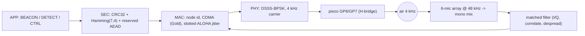
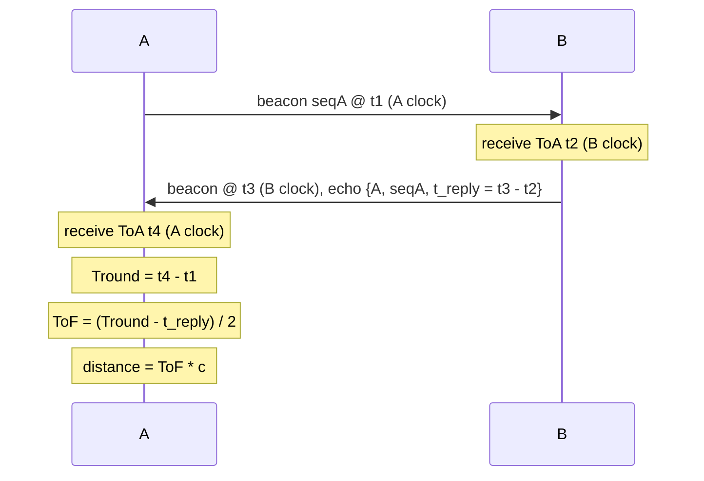

# Acoustic synchronization & node link ("chirp")

Language: **English** · [Čeština](chirp.cs.md)

This document describes how het68 nodes talk to each other, synchronize their
clocks, and measure mutual distance over the on-board **4 kHz PS1240 piezo**
(GP6/GP7) plus the **6-microphone 48 kHz array** — the "chirp" link introduced in
firmware **v1.3.0** ([`acoustic_link.c`](acoustic_link.c), [`node_store.c`](node_store.c)).

For a shorter FAQ-oriented overview (UART logging, frame variability, how the
link fits the rest of the firmware), see [`wiki.md`](wiki.md) /
[`wiki.cs.md`](wiki.cs.md).

- Design goals: collision-resistant multi-node operation, mutual time sync,
  mutual ranging, good range, and minimal audibility.
- Constraints (see [`AGENTS.md`](AGENTS.md)): no `malloc`/`free` in the realtime
  audio path, no blocking in IRQs/DMA/USB callbacks, bounded static buffers.

---

## 1. Signal path



- **TX**: the PS1240 is driven differentially from GP6/GP7 as a software H-bridge
  (see [`buzzer.c`](buzzer.c)). Flipping which channel is inverted flips the
  carrier phase by 180 deg, i.e. one BPSK chip. The chip-rate ISR streams an
  arbitrary chip buffer (`buzzer_tx_chips`) and falls back to the periodic PN
  beacon when idle.
- **RX**: [`main.c`](main.c) mixes the six microphone samples into a mono stream
  inside `build_usb_frame_from_i2s()` and calls `acoustic_link_rx_push()`. The
  heavy matched filter runs later, in bounded chunks, from
  `acoustic_link_poll()` on the main loop.

---

## 2. Physical layer (PHY)

Direct-sequence spread spectrum (DSSS) with BPSK on a 4 kHz carrier.

| Parameter | Symbol | Value |
|---|---|---|
| Carrier | `ALINK_CARRIER_HZ` | 4000 Hz |
| Sample rate | `ALINK_FS_HZ` | 48000 Hz |
| Samples per carrier cycle | `ALINK_SAMPLES_CYCLE` | 12 |
| Carrier cycles per chip | `ALINK_CYCLES_CHIP` | 8 |
| Samples per chip | `ALINK_SAMPLES_CHIP` | 96 |
| Chip rate | `ALINK_CHIP_HZ` | 500 chip/s (2 ms/chip) |
| Preamble length | `ALINK_PREAMBLE_LEN` | 127 chips |
| Data spreading factor | `ALINK_DATA_SF` | 8 chips/bit |
| Distinct node codes | `ALINK_MAX_NODES` | 8 |

Each transmitted chip is a phase (0 or 180 deg). A BPSK amplitude `a in {+1,-1}`
maps to a phase bit `p = (a < 0)`. The despreader recovers a data bit `b` because

```
1 - 2*(b XOR c) = (1 - 2*b) * (1 - 2*c)
```

so multiplying the received chip by the local code chip `(1 - 2*c)` and summing
over the spreading factor yields `(1 - 2*b) * SF * channel`.

### Codes (CDMA)

Per-node codes are a **Gold-code family** built from two maximal-length degree-7
LFSRs (a preferred-pair construction):

- seq A: `x^7 + x^6 + 1`
- seq B: `x^7 + x^3 + 1`
- node code: `code_n[k] = A[k] XOR B[(k + n) mod 127]`, mapped to +/-1.

The **preamble** is the sender's full length-127 code (used for acquisition,
sender identity, and time-of-arrival). The **data spreading code** is the first
`SF` chips of the same code. Distinct nodes therefore separate at the correlator
(code-division multiple access), which is what makes simultaneous transmissions
survivable.

> Note: the exact preferred-pair optimality of these two polynomials is not
> bench-verified; node separation also leans on the MAC layer (below).

---

## 3. Frame format

A fixed 31-byte plaintext frame keeps RX sizing constant.

| Offset | Field | Bytes |
|---|---|---|
| 0 | version (`ALINK_VERSION` = 1) | 1 |
| 1 | node_id (sender) | 1 |
| 2 | type (BEACON/DETECT/CTRL/ACK) | 1 |
| 3 | seq | 1 |
| 4 | flags (encrypted / ack-req / synced) | 1 |
| 5 | key_id (crypto, reserved) | 1 |
| 6..9 | nonce (crypto, reserved, LE32) | 4 |
| 10 | len (payload length 0..16) | 1 |
| 11..26 | payload (padded to 16) | 16 |
| 27..30 | CRC32 over bytes 0..26 (LE) | 4 |

- **FEC**: each byte is split into two nibbles, each encoded with **Hamming(7,4)**
  (single-error-correcting). 31 bytes -> 62 nibbles -> 434 coded bits
  (`ALINK_CODED_BITS`).
- **Integrity**: CRC32 (IEEE 802.3 polynomial `0xEDB88320`, the same one used by
  the flash stores).
- **Crypto-ready**: the `encrypted` flag plus `key_id`/`nonce` are wired to
  `crypto_seal()` / `crypto_open()` hooks. Today these are an identity no-op; the
  target is AEAD (encrypt-then-MAC, e.g. ChaCha20-Poly1305). Because the fields
  already exist on the wire, enabling encryption later needs no frame change.

The coded bit stream is spread to chips as: 127 preamble chips followed by
`434 * 8 = 3472` data chips, i.e. `ALINK_TX_CHIPS = 3599` chips total.

---

## 4. Multiple access & collision resistance

1. **CDMA** — different nodes use different Gold codes; the correlator recovers
   the strongest aligned code even when transmissions overlap.
2. **Slotted-ALOHA jitter** — beacons are scheduled every `BEACON_BASE_MS`
   (1500 ms) plus a random `BEACON_JITTER_MS` (0..500 ms) so periodic senders
   drift out of lock-step.
3. **Listen-before-talk** — `schedule_tx()` refuses to start a new frame while
   the local PHY is busy (`buzzer_tx_busy()`), so a node never stomps its own TX.

When alone, the node still emits the original periodic PN beacon, so v1.3.0 is a
no-op change in a single-node setup.

---

## 5. Receiver chain

Runs in `acoustic_link_poll()`, draining the SPSC ring filled by
`acoustic_link_rx_push()`.

1. **Downconvert** — multiply each mono sample by a 12-entry cos/sin NCO at 4 kHz
   to get baseband I/Q. Because 48000/4000 = 12 is integer and 96 % 12 = 0, every
   chip starts at the same NCO phase.
2. **Integrate-and-dump** — accumulate I/Q over 96 samples to form one complex
   chip value.
3. **Acquisition** — push the chip into a 127-deep circular history and correlate
   (complex, non-coherent) against all `ALINK_MAX_NODES` candidate preamble
   codes. The normalized peak is

   ```
   rho = |corr|^2 / (127 * window_energy)   in [0, 1]
   ```

   A frame is detected when `rho > DETECT_RHO` (0.30) and the window energy
   exceeds `DETECT_EMIN`. The winning code index is the sender; the correlation
   phase gives the channel reference `(cos phi, sin phi)`; the chip time is the
   time-of-arrival (ToA).
4. **Despread** — for each of the 434 data bits, sum `SF` chips multiplied by the
   sender's data code, derotate by `phi`, and slice the real part to a bit.
5. **Decode** — Hamming-decode 434 bits -> 31 bytes, check CRC32 and version,
   then dispatch. Bad CRC increments `rx_bad_crc` and the receiver returns to
   search.

---

## 6. Two-way ranging (mutual distance)

Beacons double as ranging packets. het68 uses **single-sided two-way ranging
(SS-TWR)** with broadcast beacons ([`node_store.c`](node_store.c)):



- `A` remembers the transmit time `t1` of each of its recent beacon polls
  (`node_store_note_tx`, an 8-deep ring keyed by seq). The accurate `t1` is the
  preamble emission time reported by `buzzer_tx_start_us()`.
- `B` echoes the most-recently-heard peer in its next beacon: `echo_node`,
  `echo_seq`, and the turnaround `t_reply = now - last_rx` (`node_store_pending_echo`).
- When `A` hears a beacon whose `echo_node == A` and `echo_seq` matches an
  outstanding poll, it computes `ToF` and then `distance = ToF * c`.
- **c** is the current speed of sound from the DPS310 model (`doa_c_sound_m_s()`),
  so ranging tracks temperature/pressure/humidity.
- Sanity gate: `0 <= ToF < 600 ms` (~200 m); otherwise the sample is rejected.

The coarse relative clock offset is also derived:
`offset(A-B) = t4 - t3 - ToF`, where `t3` is the peer's transmit timestamp carried
in the payload.

---

## 7. Time synchronization

Two levels:

- **Coarse (epoch) sync.** A synced node advertises `flags.SYNCED` and puts its
  Unix epoch in the beacon payload. An **unsynced** node adopts it via
  `het68_time_sync_from(epoch, HET68_TIME_SRC_ACOUSTIC, quality=60)`. This makes
  `TIME` / `TIME INFO` report source `acoustic`, alongside the existing `uart`
  and `rid` sources ([`het68_time.h`](het68_time.h)). Detection-log timestamps
  then work on nodes that never received a UART or OpenDroneID time.
- **Fine (offset) sync.** The SS-TWR exchange yields the per-peer
  `clock_offset_us` (see section 6), which quantifies the residual skew between
  neighbours and can later discipline a local phase-locked estimate.

The acoustic epoch quality (60) is deliberately lower than UART/RID so a direct
time source always wins.

---

## 8. Wi-Fi wake / OTA (control plane -> data plane)

The acoustic link is a low-rate **always-on control plane**. For bulk data or
firmware upgrade it can hand off to Wi-Fi:

- A `CTRL` frame with subtype `WIFI_WAKE` carries a rendezvous token.
- On receipt, CYW43 boards (`pico_w`, `pico2_w`, Pico Plus 2 W) flag a Wi-Fi
  bring-up (`HET68_WIFI_WAKE=1`); the application layer polls
  `acoustic_link_wifi_wake_pending()` to drive the STA connect + bulk sync / OTA.
  On non-wireless `pico2` the handler compiles to a stub that only logs.

> The actual STA connect + OTA transfer is intentionally deferred: it needs
> SSID/credential provisioning and must coexist with the BTstack/RID `cyw43_arch`
> instance. The wire format and trigger are in place now.

---

## 9. CLI reference

Over the debug UART (see [`cli.c`](cli.c)):

| Command | Action |
|---|---|
| `LINK` | link status + peer/ranging table |
| `LINK ID <0-7>` | set this node's acoustic id / CDMA code |
| `LINK BEACON` | send one beacon now |
| `LINK WIFI` | broadcast a `WIFI_WAKE` control frame |

`STATUS` and the boot dump include the `LINK` block:
`node`, `tx`, `rx`, `bad_crc`, `peers`, `wifi_wake`, followed by the peer table
(`id`, `rx`, `q`, `dist_m`, `offset_us`, `synced`).

The fixed node id can also be set at build time: `HET68_NODE_ID=3 ./build.sh`.

---

## 10. Air-time & data-rate budget

- Chip = 2 ms. Preamble = 127 chips = 254 ms. Data = 3472 chips = 6.944 s.
  **One frame ~ 7.2 s** on air.
- Net information: 31 bytes/frame over ~7.2 s ~= 34 info bit/s (payload is 16 of
  those bytes).
- Beacon cadence is therefore effectively `max(BEACON_BASE_MS, frame air-time)`
  plus jitter.

This is intentionally a slow, robust control/ranging plane. To trade robustness
for speed, reduce `ALINK_DATA_SF`, shorten the frame, or raise the chip rate
(`ALINK_CYCLES_CHIP`). Larger payloads and OTA belong on the Wi-Fi plane.

---

## 11. Audibility

The link stays on the ~4 kHz PS1240 resonance (chosen for range), which is in the
most sensitive human hearing band, so it is **not truly inaudible**. Perceptibility
is minimized by spread-spectrum coding (energy spread thin, RX works below 0 dB
SNR via processing gain), low duty cycle, and randomized timing, so bursts sound
like faint clicks/hiss rather than a tone.

---

## 12. Limitations & future work

- **Not hardware-validated**: acquisition thresholds, ToA precision, and the
  Gold preferred-pair choice are best-effort and need bench tuning.
- **ToA is chip-resolution** today (2 ms ~ 0.69 m). Sub-chip interpolation on the
  correlation peak would sharpen ranging.
- **SS-TWR** assumes reciprocity; **double-sided TWR** would cancel clock skew.
- **Crypto** is a no-op stub; wiring real AEAD into `crypto_seal`/`crypto_open`
  enables the `encrypted` flag with no wire change.
- **Wi-Fi** wake sets a flag only; the STA connect + OTA path is future work.

---

## 13. Source map

- [`acoustic_link.h`](acoustic_link.h) / [`acoustic_link.c`](acoustic_link.c) —
  PHY, framing, FEC/CRC, crypto hooks, TX scheduler, RX matched filter, dispatch.
- [`node_store.h`](node_store.h) / [`node_store.c`](node_store.c) — peer table,
  SS-TWR ranging, clock offset.
- [`buzzer.h`](buzzer.h) / [`buzzer.c`](buzzer.c) — piezo PHY + chip-stream TX.
- [`het68_time.h`](het68_time.h) / [`het68_time.c`](het68_time.c) — clock with the
  `acoustic` source.
- [`main.c`](main.c) — mono RX tap + `acoustic_link_poll()` in the main loop.
- [`cli.c`](cli.c) — `LINK` commands + `STATUS` integration.
