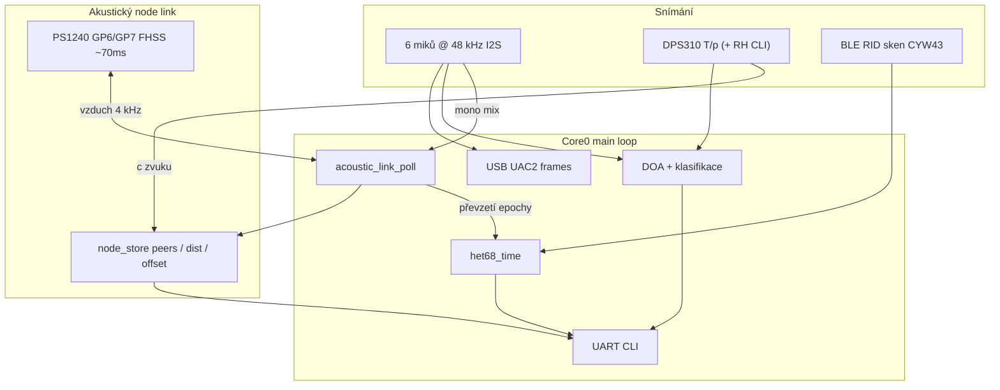

# het68 wiki — pochopení současného firmware

Jazyk: **Čeština** · [English](wiki.md)

Tato wiki vysvětluje **současné** řešení het68 na větvi `main`
(akustický node link **v1.4.x** a související subsystémy). Rozšiřuje praktické
otázky kolem UART logů a formátu chirp zpráv a zasazuje je do zbytku stacku.

Úplná protokolová reference (PHY, ranging, MAC, air-time):
[`chirp.cs.md`](chirp.cs.md) / [`chirp.md`](chirp.md).
Přehled projektu a build: [`README.md`](README.md), [`BUILDING.md`](BUILDING.md).

---

## 1. Co firmware je

het68 je USB audio firmware pro Raspberry Pi Pico / Pico 2 (RP2040 / RP2350):

| Role | Co dělá |
|---|---|
| USB UAC2 zvukovka | 6kanálový vstup mikrofonů 48 kHz ze 3× stereo I2S (PIO + DMA + TinyUSB) |
| Akustický front-end | On-device DOA / klasifikace (dron, ptáci, vozidla, …) bez host PC |
| Baro + rychlost zvuku | Grove DPS310 (GP2/GP3 I2C1) → vlhký vzduch \(c(T,p,\mathrm{RH})\) pro DOA i ranging |
| Časová základna | `TIME` / `TIME INFO` se zdroji `uart`, `rid`, `acoustic` |
| Remote ID | BLE OpenDroneID sken na deskách s CYW43 |
| Node link („chirp“) | Objev sousedů, hrubá sync hodin, vzájemný ranging přes piezo 4 kHz |

Tvrdá omezení ([`AGENTS.md`](AGENTS.md)): žádné `malloc`/`free` v realtime
audio cestě; žádné blokování v IRQ / DMA / USB callbackách; držet PIO, DMA a
USB frame velikosti konzistentní.

---

## 2. Velký obrázek — jak se části propojují



- **TX chirp:** APP rámec → CRC32 → 31čipová BPSK preambule @ 4 kHz +
  2-FSK FHSS data → `buzzer_tx_chips_fh()` na GP6/GP7 (~70 ms air-time).
- **RX chirp:** šest miků smícháno do mono v `build_usb_frame_from_i2s()` →
  `acoustic_link_rx_push()` (levný ring) → matched filter v
  `acoustic_link_poll()` (ohraničeně, main loop).
- **Ranging / peery:** každý platný `BEACON` aktualizuje
  [`node_store`](node_store.c); vzdálenost používá `doa_c_sound_m_s()`.

Poznámka k pinům: **GP2/GP3 = DPS310 I2C**, **GP6/GP7 = piezo**. Neměnit mapování
bez aktualizace dokumentace ([`wiring_and_bom.md`](wiring_and_bom.md)).

---

## 3. FAQ — UART: co ze souseda se loguje?

### Krátká odpověď

Při **automatickém příjmu** se na UART vypíše jen několik typů rámců. Úspěšné
**BEACONy ne**. Jejich obsah zůstává v RAM a ukáže se na vyžádání přes
`LINK` / `STATUS`.

### Automatické UART řádky (RX / boot)

| Událost | Typický UART řádek | Poznámka |
|---|---|---|
| Boot / init | `LINK: acoustic node link (… FHSS-BPSK <100ms) node=` | Jednou při startu |
| Rámec `DETECT` | `LINK DETECT from=<id> cls=<n>` | Peer id + bajt třídy |
| `CTRL` `WIFI_WAKE` | `LINK: WIFI_WAKE token=…` nebo „no Wi-Fi…“ | Nastaví i wake-pending flag |
| `CTRL` `OTA_REQ` | `LINK: OTA_REQ received` | Placeholder; OTA přenos ještě není |
| `BEACON` | *(nic)* | Update `node_store`; může **tiše** volat `het68_time_sync_from(..., ACOUSTIC)` |

Tedy: ranging pole, epocha, echo/SS-TWR data, kvalita korelace a tabulka peerů
se **nepíšou** při každém dekódu.

### UART na vyžádání (`LINK`, `STATUS`, boot dump)

`acoustic_link_status_uart()` a pak `node_store_list_uart()`:

```
LINK node=<id> ver=2 air_ms=69 tx=<n> rx=<n> bad_crc=<n> peers=<n> wifi_wake=<0|1>
=== node peers ===
NODE id=<id> rx=<n> q=<0.xx> dist_m=<m>|dist=? offset_us=<…> synced=<0|1>
…
```

| Pole | Význam |
|---|---|
| `ver` / `air_ms` | Verze na drátě (2) a nominální air-time chirpu |
| `tx` / `rx` / `bad_crc` | Lokální počítadla linku |
| `peers` | Obsazené sloty v `node_store` (max 8) |
| `q` | Poslední kvalita matched filtru \(0..1\) |
| `dist_m` | SS-TWR vzdálenost po platném echu; jinak `dist=?` |
| `offset_us` | Hrubý `our_clock − peer_clock` ze stejné výměny |
| `synced` | Peer inzeroval `ALINK_FLAG_SYNCED` |

CLI: `LINK`, `LINK ID <0-7>`, `LINK BEACON`, `LINK WIFI` — viz [`cli.c`](cli.c).

### Proč je BEACON tichý

Maják trvá jen ~70 ms na vzduchu, ale opakuje se často. Logovat každý dekód by
zaplavilo UART a překrylo DET/RID/CMP provoz. Návrh: **tiché uložení +
explicitní dump**.

---

## 4. FAQ — struktura chirp zprávy a její variabilita

### Pevná velikost na vzduchu (vždy)

Každý rámec je **pevných 31 bajtů** plaintextu. Na vzduchu (v1.4 / wire v2):

| Offset | Pole | Bajtů |
|---|---|---|
| 0 | `version` (`ALINK_VERSION` = **2**) | 1 |
| 1 | `node_id` (odesílatel, 0..7) | 1 |
| 2 | `type` | 1 |
| 3 | `seq` | 1 |
| 4 | `flags` | 1 |
| 5 | `key_id` (crypto, rezervováno) | 1 |
| 6..9 | `nonce` LE32 (crypto, rezervováno) | 4 |
| 10 | `len` (logická délka payloadu 0..16) | 1 |
| 11..26 | `payload` (vždy doplněno na 16) | 16 |
| 27..30 | CRC32 LE přes bajty 0..26 | 4 |

Pak: **248 raw bitů** (bez Hammingu) jako 2-FSK hopy + **31** BPSK preambulí
@ 4 kHz = **279** čipů × **250 µs** ≈ **70 ms**.

### Co se skutečně mění

Variabilita je **sémantická**, ne délková:

1. **`type`** — `BEACON=0`, `DETECT=1`, `CTRL=2`, `ACK=3`
2. **`flags`** — `ENCRYPTED` (0x01, stub), `ACK_REQ` (0x02), `SYNCED` (0x04)
3. **`seq`**, **`node_id`**, počítadla / časová razítka v payloadu
4. **CDMA posun preambule** + **základ hop páru** — z `node_id`
5. **Hop tón na bit** — která ze dvou FSK frekvencí nese bit
6. **`len`** — deklarováno 0..16; TX stejně paduje 16bajtový slot

Co se **nemění**: počet bajtů rámce, počet čipů, dwell čipu, air-time.

### Layouty payloadu (uvnitř pevných 16 B)

**BEACON** (periodický scheduler + `LINK BEACON`):

| Off | Obsah |
|---|---|
| 0..3 | `tx_mono` LE32 — monotonic µs odesílatele (low 32) |
| 4..7 | Unix epocha LE32 — `0` pokud není sync |
| 8 | `echo_node` — id peeru pro SS-TWR, nebo `0xFF` |
| 9..12 | `t_reply` LE32 — turnaround \(t_3 - t_2\) |
| 13 | `echo_seq` — seq pollu, který se echo-uje |
| 14 | synced bajt `0/1` |
| 15 | padding |

**DETECT:** kompaktní souhrn; UART bere `payload[0]` jako `cls` + `node_id` z hlavičky.

**CTRL:** `payload[0]` = subtype (`WIFI_WAKE=1`, `OTA_REQ=2`); u wake
`payload[1]` = rendezvous token.

**Crypto:** `key_id` / `nonce` / `ENCRYPTED` jsou na drátě; `crypto_seal` /
`crypto_open` jsou identity stuby — zapnutí AEAD později nevyžaduje změnu
velikosti rámce.

---

## 5. Ranging a čas (co BEACON přináší)

### Single-sided two-way ranging (SS-TWR)

Broadcast majáky slouží i jako ranging pakety ([`node_store.c`](node_store.c)):

1. **A** pošle maják `seqA` v \(t_1\) (hodiny A); zapamatuje \((seqA, t_1)\).
2. **B** uslyší v \(t_2\); další maják echo-uje `{A, seqA, t_\mathrm{reply}=t_3-t_2}`.
3. **A** uslyší B v \(t_4\); \(\mathrm{ToF}=(t_4-t_1 - t_\mathrm{reply})/2\);
   \(\mathrm{vzdálenost} = \mathrm{ToF} \cdot c\).

\(c\) bere barometrický model vlhkého vzduchu (`doa_c_sound_m_s()`). Sanity:
\(0 \le \mathrm{ToF} < 600\,\mathrm{ms}\) (~200 m).

Hrubý offset hodin: \(\mathrm{offset}(A-B) = t_4 - t_3 - \mathrm{ToF}\)
(\(t_3\) nesen jako peer TX mono v payloadu).

### Úrovně synchronizace času

| Úroveň | Mechanismus | Viditelné jako |
|---|---|---|
| Hrubá epocha | Nesync node převezme epochu peeru s `SYNCED` | `TIME INFO` zdroj `acoustic`, quality 60 |
| Jemný offset | Per-peer `clock_offset_us` z SS-TWR | `NODE … offset_us=` v `LINK` |

Akustická quality je záměrně nižší než UART/RID, aby přímý zdroj vyhrál.

---

## 6. Vícenásobný přístup, rychlost a slyšitelnost

- **CDMA preambule:** 8 posunů m-sekvence délky 31; korelátor bere nejsilnější
  shodu (`rho > 0.28` + energetický práh).
- **FHSS data:** 8tónová hop množina; bit = porovnání energie páru tónů.
- **Slotted-ALOHA jitter:** základ majáku ~2000 ms + 0..800 ms náhodně; LBT přes
  `buzzer_tx_busy()`.
- **Propustnost:** ~31 info bajtů / ~70 ms burst, duty ~3,5 % při periodě 2 s —
  řídicí/ranging rovina. Bulk / OTA → `WIFI_WAKE` a Wi-Fi (odloženo).
- **Slyšitelnost:** krátké hopnuté tiky místo vícenásobného 4kHz pískotu; pořád
  ne ticho.

---

## 7. Související subsystémy (kontext celého řešení)

### DOA / klasifikace

Běží na stejném 48kHz streamu jako USB a chirp RX. Třídy a DET log / entity
persistence ovládá CLI (`DET`, `ENT`, `DRONE`, …). CMP řádky mohou slučovat
akustické DOA s RID GPS.

### Barometr a \(c\)

DPS310 na I2C1; CLI `BARO` / `BARO RH`. Rychlost zvuku živí geometrii DOA i
akustický ranging, aby \(T/p/\mathrm{RH}\) odpovídaly podmínkám venku.

### Remote ID

Na wireless deskách BLE ODID → tracky + volitelná sync času ze System zpráv.
Flash store známých dronů a dump ve `STATUS` je oddělený od chirp peer tabulky
(RAM-only `node_store`).

### Wi-Fi wake

Akustický `CTRL WIFI_WAKE` nastaví `acoustic_link_wifi_wake_pending()`. Desky
CYW43 kompilují bring-up hook; bez Wi-Fi jen logují. Skutečné STA + OTA je
následná aplikační práce (credentials + koexistence s BTstack).

---

## 8. Praktický checklist operátora

1. Nahraj UF2 **v1.3.x** pro svou desku; otevři debug UART.
2. Nastav unikátní id: `LINK ID <0-7>` (nebo `HET68_NODE_ID=n ./build.sh`).
3. Volitelně: `TIME SYNC` / počkej na RID nebo akustickou epochu; zkontroluj
   `TIME INFO`.
4. Volitelně: `BARO` / `BARO RH`, ať je \(c\) (a tedy `dist_m`) rozumné.
5. Automatické řádky sleduj u `DETECT` / `WIFI_WAKE`; peery a vzdálenost přes
   `LINK`.
6. Vynutit rámec: `LINK BEACON` nebo `LINK WIFI`.

Protokol do hloubky: [`chirp.cs.md`](chirp.cs.md). Zdroje: `acoustic_link.*`,
`node_store.*`, `buzzer.*`, `het68_time.*`, `main.c`, `cli.c`.

---

## 9. Známá omezení (upřímný snapshot)

- Není plně ověřeno na hardwaru (práh, hop SPL, přesnost ToA).
- ToA je v **rozlišení čipu** (~250 µs ≈ 8,6 cm při \(c \approx 343\,\mathrm{m/s}\));
  sub-chip interpolace peaku by ranging ještě zpřesnila.
- Bez Hamming FEC — CRC + časté krátké majáky.
- SS-TWR ≠ double-sided TWR (rušení skew není kompletní).
- Crypto a Wi-Fi OTA jsou hooky/stuby, ne end-to-end funkce.
- BEACON RX záměrně nejde na UART — peery prohlížej přes `LINK`.
- v1.4 (`version=2`) **není** interoperabilní s v1.3 DSSS rámci.

---

## 10. Mapa dokumentace

| Dokument | Jazyk | Role |
|---|---|---|
| [`wiki.md`](wiki.md) / [`wiki.cs.md`](wiki.cs.md) | EN / CS | Pochopení + FAQ (tato stránka) |
| [`chirp.md`](chirp.md) / [`chirp.cs.md`](chirp.cs.md) | EN / CS | Úplný akustický protokol |
| [`README.md`](README.md) | EN | Přehled produktu, CLI, releasy |
| [`BUILDING.md`](BUILDING.md) | EN | Build / desky |
| [`wiring_and_bom.md`](wiring_and_bom.md) | EN | Piny / BOM |
| [`AGENTS.md`](AGENTS.md) | EN | Tvrdá pravidla firmware pro přispěvatele |
