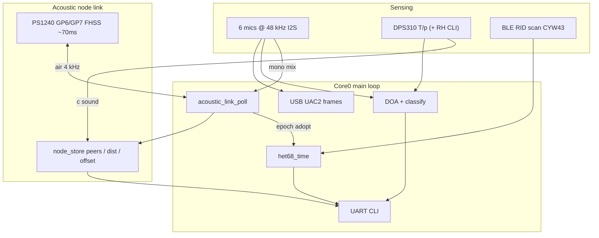

# het68 wiki — understanding the current firmware

Language: **English** · [Čeština](wiki.cs.md)

This wiki explains the **current** het68 solution as shipped on `main`
(acoustic node link **v1.4.x** and related subsystems). It expands the practical
questions that come up when reading UART logs and the chirp wire format, and
ties them into the rest of the stack.

For the full protocol reference (PHY parameters, ranging math, MAC, air-time
budget), see [`chirp.md`](chirp.md) / [`chirp.cs.md`](chirp.cs.md).
Project overview and build: [`README.md`](README.md), [`BUILDING.md`](BUILDING.md).

---

## 1. What the firmware is

het68 is Raspberry Pi Pico / Pico 2 USB audio firmware (RP2040 / RP2350):

| Role | What it does |
|---|---|
| USB UAC2 sound card | 6-channel mic input at 48 kHz from 3× stereo I2S pairs (PIO + DMA + TinyUSB) |
| Acoustic front-end | On-device DOA / classify (drone, birds, vehicles, …) without a host PC |
| Baro + speed of sound | Grove DPS310 (GP2/GP3 I2C1) → moist-air \(c(T,p,\mathrm{RH})\) for DOA and ranging |
| Time base | `TIME` / `TIME INFO` with sources `uart`, `rid`, `acoustic` |
| Remote ID | BLE OpenDroneID scan on CYW43 boards |
| Node link (“chirp”) | Neighbour discovery, coarse clock sync, mutual ranging over the 4 kHz piezo |

Hard constraints ([`AGENTS.md`](AGENTS.md)): no `malloc`/`free` in the realtime
audio path; no blocking in IRQ / DMA / USB callbacks; keep PIO, DMA and USB
frame sizes consistent.

---

## 2. Big picture — how pieces connect



- **TX path for chirp:** APP frame → CRC32 → 31-chip BPSK preamble @ 4 kHz +
  2-FSK FHSS data chips → `buzzer_tx_chips_fh()` on GP6/GP7 (~70 ms air-time).
- **RX path for chirp:** six mics mixed to mono inside `build_usb_frame_from_i2s()`
  → `acoustic_link_rx_push()` (cheap ring) → matched filter in
  `acoustic_link_poll()` (bounded, main loop).
- **Ranging / peers:** every valid `BEACON` updates [`node_store`](node_store.c);
  distance uses `doa_c_sound_m_s()`.

Pin note: **GP2/GP3 = DPS310 I2C**, **GP6/GP7 = piezo**. Do not remap without
updating docs ([`wiring_and_bom.md`](wiring_and_bom.md)).

---

## 3. FAQ — UART: what neighbour info is logged?

### Short answer

On **automatic receive**, only a few frame types print a line. Successful
**BEACONs do not**. Their content is stored in RAM and shown on demand via
`LINK` / `STATUS`.

### Automatic UART lines (RX / boot)

| Event | Typical UART line | Notes |
|---|---|---|
| Boot / init | `LINK: acoustic node link (… FHSS-BPSK <100ms) node=` | Once at bring-up |
| `DETECT` frame | `LINK DETECT from=<id> cls=<n>` | Logs peer id + class byte |
| `CTRL` `WIFI_WAKE` | `LINK: WIFI_WAKE token=…` or “no Wi-Fi on this board” | Also sets wake-pending flag |
| `CTRL` `OTA_REQ` | `LINK: OTA_REQ received` | Placeholder; no OTA transfer yet |
| `BEACON` | *(none)* | Updates `node_store`; may call `het68_time_sync_from(..., ACOUSTIC)` **silently** |

So: ranging fields, epoch, echo/SS-TWR data, correlation quality, and peer
tables are **not** spammed on every decode.

### On-demand UART (`LINK`, `STATUS`, boot dump)

`acoustic_link_status_uart()` then `node_store_list_uart()`:

```
LINK node=<id> ver=2 air_ms=69 tx=<n> rx=<n> bad_crc=<n> peers=<n> wifi_wake=<0|1>
=== node peers ===
NODE id=<id> rx=<n> q=<0.xx> dist_m=<m>|dist=? offset_us=<…> synced=<0|1>
…
```

| Field | Meaning |
|---|---|
| `ver` / `air_ms` | Wire version (2) and nominal chirp air-time |
| `tx` / `rx` / `bad_crc` | Local link counters |
| `peers` | Occupied slots in `node_store` (max 8) |
| `q` | Last matched-filter quality \(0..1\) |
| `dist_m` | SS-TWR distance when a valid echo completed; else `dist=?` |
| `offset_us` | Coarse `our_clock − peer_clock` from the same exchange |
| `synced` | Peer advertised `ALINK_FLAG_SYNCED` |

CLI: `LINK`, `LINK ID <0-7>`, `LINK BEACON`, `LINK WIFI` — see [`cli.c`](cli.c).

### Why BEACON is quiet

A beacon is only ~70 ms on air but still repeats often. Logging every decode
would flood UART and hide DET/RID/CMP traffic. The design is: **silent store +
explicit dump**.

---

## 4. FAQ — chirp message structure and variability

### Fixed on-air size (always)

Every frame is a **fixed 31-byte plaintext**. On air (v1.4 / wire v2):

| Offset | Field | Bytes |
|---|---|---|
| 0 | `version` (`ALINK_VERSION` = **2**) | 1 |
| 1 | `node_id` (sender, 0..7) | 1 |
| 2 | `type` | 1 |
| 3 | `seq` | 1 |
| 4 | `flags` | 1 |
| 5 | `key_id` (crypto reserved) | 1 |
| 6..9 | `nonce` LE32 (crypto reserved) | 4 |
| 10 | `len` (logical payload length 0..16) | 1 |
| 11..26 | `payload` (always padded to 16) | 16 |
| 27..30 | CRC32 LE over bytes 0..26 | 4 |

Then: **248 raw bits** (no Hamming) as 2-FSK hops + **31** BPSK preamble chips
@ 4 kHz = **279** chips × **250 µs** ≈ **70 ms**.

### What actually varies

Variability is **semantic**, not length:

1. **`type`** — `BEACON=0`, `DETECT=1`, `CTRL=2`, `ACK=3`
2. **`flags`** — `ENCRYPTED` (0x01, stub), `ACK_REQ` (0x02), `SYNCED` (0x04)
3. **`seq`**, **`node_id`**, counters / timestamps inside payload
4. **CDMA preamble shift** + **hop-pair base** — from sender `node_id`
5. **Per-bit hop tone** — which of two FSK frequencies carries the bit
6. **`len`** — declared 0..16; TX still pads the 16-byte payload slot

What does **not** vary: frame byte count, chip count, chip dwell, air-time.

### Payload layouts (inside the fixed 16 B)

**BEACON** (periodic scheduler + `LINK BEACON`):

| Off | Content |
|---|---|
| 0..3 | `tx_mono` LE32 — sender monotonic µs (low 32) at schedule time |
| 4..7 | Unix epoch LE32 — `0` if not synced |
| 8 | `echo_node` — peer id being answered for SS-TWR, or `0xFF` |
| 9..12 | `t_reply` LE32 — turnaround \(t_3 - t_2\) |
| 13 | `echo_seq` — seq of the poll being echoed |
| 14 | synced byte `0/1` (mirrors header flag intent) |
| 15 | padding |

**DETECT:** compact summary; UART uses `payload[0]` as `cls` plus header `node_id`.

**CTRL:** `payload[0]` = subtype (`WIFI_WAKE=1`, `OTA_REQ=2`); for wake,
`payload[1]` = rendezvous token.

**Crypto:** `key_id` / `nonce` / `ENCRYPTED` are on the wire; `crypto_seal` /
`crypto_open` are identity stubs — enabling AEAD later needs no frame resize.

---

## 5. Ranging and time (what a BEACON buys you)

### Single-sided two-way ranging (SS-TWR)

Broadcast beacons double as ranging packets ([`node_store.c`](node_store.c)):

1. **A** sends beacon `seqA` at \(t_1\) (A clock); remembers \((seqA, t_1)\).
2. **B** hears it at \(t_2\); next beacon echoes `{A, seqA, t_\mathrm{reply}=t_3-t_2}`.
3. **A** hears B at \(t_4\); \(\mathrm{ToF}=(t_4-t_1 - t_\mathrm{reply})/2\);
   \(\mathrm{distance} = \mathrm{ToF} \cdot c\).

\(c\) comes from the baro moist-air model (`doa_c_sound_m_s()`). Sanity gate:
\(0 \le \mathrm{ToF} < 600\,\mathrm{ms}\) (~200 m).

Coarse clock offset: \(\mathrm{offset}(A-B) = t_4 - t_3 - \mathrm{ToF}\)
(with \(t_3\) carried as peer TX mono in the payload).

### Time sync levels

| Level | Mechanism | Visible as |
|---|---|---|
| Coarse epoch | Unsynced node adopts peer epoch when peer has `SYNCED` | `TIME INFO` source `acoustic`, quality 60 |
| Fine offset | Per-peer `clock_offset_us` from SS-TWR | `NODE … offset_us=` in `LINK` |

Acoustic quality is intentionally below UART/RID so a direct source wins.

---

## 6. Multiple access, rate, and audibility

- **CDMA preamble:** 8 shifts of a length-31 m-sequence; correlator picks the
  strongest match (`rho > 0.28` + energy gate).
- **FHSS data:** 8-tone hop set; bit = energy compare of a tone pair.
- **Slotted-ALOHA jitter:** beacon base ~2000 ms + 0..800 ms random; LBT via
  `buzzer_tx_busy()`.
- **Throughput:** ~31 info bytes / ~70 ms burst, duty ~3.5% at 2 s period —
  control/ranging plane. Bulk / OTA → `WIFI_WAKE` then Wi-Fi (deferred).
- **Audibility:** short hopped ticks instead of a multi-second 4 kHz whistle;
  still not silent.

---

## 7. Related subsystems (current solution context)

### DOA / classify

Runs on the same 48 kHz mic stream as USB and chirp RX. Classes and DET log /
entity persistence are CLI-driven (`DET`, `ENT`, `DRONE`, …). CMP lines can fuse
acoustic DOA with RID GPS when both exist.

### Barometer and \(c\)

DPS310 on I2C1; CLI `BARO` / `BARO RH`. Speed of sound feeds both DOA geometry
and acoustic ranging so temperature/pressure/humidity track outdoor conditions.

### Remote ID

On wireless boards, BLE ODID → tracks + optional time sync from System messages.
Known-drone flash store and `STATUS` flash dump are separate from the chirp peer
table (RAM-only `node_store`).

### Wi-Fi wake

Acoustic `CTRL WIFI_WAKE` sets `acoustic_link_wifi_wake_pending()`. CYW43 boards
compile the bring-up hook; non-wireless boards only log. Actual STA + OTA is
application follow-up work (credentials + coexistence with BTstack).

---

## 8. Practical operator checklist

1. Flash a **v1.3.x** UF2 for your board; open debug UART.
2. Set unique ids: `LINK ID <0-7>` (or `HET68_NODE_ID=n ./build.sh`).
3. Optional: `TIME SYNC` / wait for RID or acoustic epoch; check `TIME INFO`.
4. Optional: `BARO` / `BARO RH` so \(c\) (and thus `dist_m`) is sane.
5. Watch automatic lines for `DETECT` / `WIFI_WAKE`; use `LINK` for peers and
   distance.
6. Force a frame: `LINK BEACON` or `LINK WIFI`.

Deep protocol: [`chirp.md`](chirp.md). Sources: `acoustic_link.*`, `node_store.*`,
`buzzer.*`, `het68_time.*`, `main.c`, `cli.c`.

---

## 9. Known limits (honest snapshot)

- Not fully hardware-validated (thresholds, Gold pair, ToA accuracy).
- ToA is **chip-resolution** (~250 µs ≈ 8.6 cm at \(c \approx 343\,\mathrm{m/s}\));
  sub-chip peak interpolation would sharpen ranging further.
- No Hamming FEC — CRC + frequent short beacons.
- SS-TWR ≠ double-sided TWR (skew cancellation incomplete).
- Crypto and Wi-Fi OTA are hooks/stubs, not end-to-end features yet.
- BEACON RX stays off the UART by design — use `LINK` to inspect peers.
- v1.4 (`version=2`) is **not** interoperable with v1.3 DSSS frames.

---

## 10. Doc map

| Doc | Language | Role |
|---|---|---|
| [`wiki.md`](wiki.md) / [`wiki.cs.md`](wiki.cs.md) | EN / CS | Understanding + FAQ (this page) |
| [`chirp.md`](chirp.md) / [`chirp.cs.md`](chirp.cs.md) | EN / CS | Full acoustic-link protocol |
| [`README.md`](README.md) | EN | Product overview, CLI, releases |
| [`BUILDING.md`](BUILDING.md) | EN | Build / boards |
| [`wiring_and_bom.md`](wiring_and_bom.md) | EN | Pins / BOM |
| [`AGENTS.md`](AGENTS.md) | EN | Firmware hard rules for contributors |
